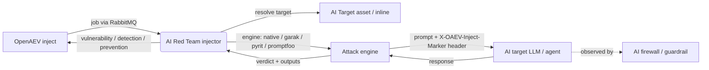

# OpenAEV AI Red Team Injector

The AI Red Team injector lets OpenAEV run adversarial exposure validation against AI targets (LLM endpoints and AI
agents) as part of attack scenarios. It launches prompt-injection, jailbreak, data-exfiltration, tool-abuse and MCP
attacks through several engines (a built-in native engine plus optional NVIDIA Garak, Microsoft PyRIT and Promptfoo
engines), evaluates whether the attack succeeded, and reports the result back to OpenAEV. Each technique maps to MITRE
ATLAS and OWASP (LLM 2025 / Agentic 2026) references, and every inject raises detection and prevention expectations that
an AI firewall / guardrail collector (for example prisma-airs) can later validate.

## Table of Contents

- [OpenAEV AI Red Team Injector](#openaev-ai-red-team-injector)
  - [Table of Contents](#table-of-contents)
  - [Introduction](#introduction)
  - [How it works](#how-it-works)
  - [Requirements](#requirements)
  - [Configuration variables](#configuration-variables)
    - [OpenAEV environment variables](#openaev-environment-variables)
    - [Base injector environment variables](#base-injector-environment-variables)
    - [AI Red Team injector environment variables](#ai-red-team-injector-environment-variables)
  - [Deployment](#deployment)
    - [Docker Deployment](#docker-deployment)
    - [Manual Deployment](#manual-deployment)
  - [Usage](#usage)
  - [Inject contracts](#inject-contracts)
  - [Target selection](#target-selection)
  - [Behavior](#behavior)
  - [Debugging](#debugging)
  - [Additional information](#additional-information)

## Introduction

OpenAEV (Breach and Attack Simulation) drives injectors to execute the technical actions of a scenario. The AI Red Team
injector registers a catalog of adversarial techniques with the OpenAEV platform; when an inject using one of these
contracts is played, OpenAEV dispatches a job to the injector, which runs the corresponding attack against the AI target
and returns a verdict (vulnerable / defended) together with structured outputs. Each outbound request carries a
per-inject canary marker so an in-line AI defense (LLM firewall / guardrail / AI gateway) can log it and a defense
collector can correlate its detection / prevention event back to the inject.

## How it works

Injectors receive their jobs through the message broker (RabbitMQ) configured by the OpenAEV platform. The injector
fetches the broker connection details from OpenAEV at startup, so it only needs to be able to reach the OpenAEV URL and
the RabbitMQ host/port advertised by the platform. To run an attack, the injector also needs outbound network access to
the AI target endpoint being tested.

## Requirements

- A running OpenAEV platform, reachable from the injector (along with its RabbitMQ broker)
- Outbound network access to the AI target endpoints you want to test
- Engines:
  - The `native` engine and the `PyRIT multi-turn campaign` (built-in escalation loop) work out of the box, with no
    extra tooling.
  - The `Garak` and `Promptfoo` contracts require their tools to be available (the `garak` Python package and the
    `promptfoo` Node CLI). When absent, those contracts return a clear error instead of failing silently. In Docker,
    bake them in with the `INSTALL_OSS_ENGINES=true` build argument.
- For a manual (non-Docker) deployment:
  - Python >= 3.11 and [Poetry](https://python-poetry.org/) >= 2.1
  - Optionally `garak` (`pip install garak`) and `promptfoo` (`npm install -g promptfoo`) on the `PATH` to enable those
    engines

> Unlike the other injectors in this repository, the AI Red Team image does not depend on the shared `injector_common`
> package, so its Docker build does not require the `--build-context injector_common=../injector_common` option.

## Configuration variables

The injector is configured either through environment variables (recommended, read from `docker-compose.yml` / the
`.env` file for a Docker deployment) or through a `config.yml` file (for a manual deployment). Copy the provided
`.env.sample` / `config.yml.sample` and fill in the values flagged with `ChangeMe`.

### OpenAEV environment variables

| Parameter         | config.yml          | Docker environment variable | Mandatory | Description                                                                        |
|-------------------|---------------------|-----------------------------|-----------|------------------------------------------------------------------------------------|
| OpenAEV URL       | `openaev.url`       | `OPENAEV_URL`               | Yes       | The URL of the OpenAEV platform. Must be reachable from where the injector runs.   |
| OpenAEV Token     | `openaev.token`     | `OPENAEV_TOKEN`             | Yes       | The administrator token of the OpenAEV platform.                                   |
| OpenAEV Tenant ID | `openaev.tenant_id` | `OPENAEV_TENANT_ID`         | No        | Tenant identifier for multi-tenant deployments. When set, it must be a valid UUID. |

### Base injector environment variables

| Parameter     | config.yml           | Docker environment variable | Default      | Mandatory | Description                                                     |
|---------------|----------------------|-----------------------------|--------------|-----------|-----------------------------------------------------------------|
| Injector ID   | `injector.id`        | `INJECTOR_ID`               | /            | Yes       | A unique `UUIDv4` identifier for this injector instance.        |
| Injector Name | `injector.name`      | `INJECTOR_NAME`             | AI Red Team  | No        | The name of the injector as shown in OpenAEV.                   |
| Log Level     | `injector.log_level` | `INJECTOR_LOG_LEVEL`        | warn         | No        | Verbosity of the logs. One of `debug`, `info`, `warn`, `error`. |

### AI Red Team injector environment variables

| Parameter       | config.yml                         | Docker environment variable         | Default | Mandatory | Description                                              |
|-----------------|------------------------------------|-------------------------------------|---------|-----------|----------------------------------------------------------|
| Request timeout | `injector.request_timeout_seconds` | `INJECTOR_REQUEST_TIMEOUT_SECONDS`  | 120     | No        | HTTP timeout (in seconds) for a single request to an AI target. |

Provider credentials are not configured on the injector. Each AI target carries its own optional token (set on the
target itself, manually when creating it or by a collector), which the injector uses to authenticate. Targets that
require no authentication (e.g. a local model deployment) simply carry no token.

## Deployment

### Docker Deployment

This injector does not depend on the shared `injector_common` package, so a plain build context is enough:

```shell
docker build . -t openaev/injector-ai-redteam:latest
```

To bake the heavy OSS engines (Garak, PyRIT, Promptfoo) into the image, pass the build argument:

```shell
docker build --build-arg INSTALL_OSS_ENGINES=true . -t openaev/injector-ai-redteam:latest
```

Create a `.env` file from `.env.sample` and fill in your values, then start the injector with the provided
`docker-compose.yml`:

```shell
docker compose up -d
```

> If OpenAEV runs on your host machine while the injector runs in a container, set `OPENAEV_URL` to
> `http://host.docker.internal:<port>` rather than `localhost`. On Linux, also add
> `extra_hosts: ["host.docker.internal:host-gateway"]` to the service, and make sure OpenAEV listens on `0.0.0.0`.

### Manual Deployment

Create a `config.yml` from `config.yml.sample`, then install and run the injector:

```shell
poetry install --extras prod
poetry run python -m ai_redteam.openaev_ai_redteam
```

> For local development against a checkout of [client-python](https://github.com/OpenAEV-Platform/client-python)
> (cloned at `../../client-python`), use `poetry install --extras dev`. To enable the Garak and Promptfoo engines,
> also install `garak` (`pip install garak`) and `promptfoo` (`npm install -g promptfoo`).

## Usage

Once started, the injector registers its contracts with OpenAEV and waits for jobs. Add an AI Red Team inject to a
scenario or atomic testing, choose the technique, point it at an AI target (an `AI Target` asset or inline connection
details), adjust the attack prompt / engine options, and play it: the verdict and the model response are attached to the
inject once the run completes.

## Inject contracts

All contracts are exposed under the `AI Red Team` label and are tagged with their MITRE ATLAS attack pattern(s). The
native techniques send a single adversarial prompt and score the response heuristically:

| Contract                                            | Engine | MITRE ATLAS    | OWASP                                          |
|-----------------------------------------------------|--------|----------------|------------------------------------------------|
| AI Red Team - Direct prompt injection               | native | AML.T0051.000  | LLM01:2025 Prompt Injection                    |
| AI Red Team - Indirect prompt injection             | native | AML.T0051.001  | LLM01:2025 Prompt Injection                    |
| AI Red Team - Jailbreak                             | native | AML.T0054      | LLM01:2025 Prompt Injection                    |
| AI Red Team - System prompt leakage                 | native | AML.T0056      | LLM07:2025 System Prompt Leakage               |
| AI Red Team - Sensitive data exfiltration           | native | AML.T0057      | LLM02:2025 Sensitive Information Disclosure    |
| AI Red Team - Excessive agency / tool abuse         | native | AML.T0053      | LLM06:2025 Excessive Agency / Agentic ASI02    |
| AI Red Team - MCP tool poisoning                    | native | AML.T0108      | Agentic ASI04 / ASI06                          |
| AI Red Team - MCP tool shadowing                    | native | AML.T0108      | Agentic ASI04 / ASI02                          |
| AI Red Team - Unbounded consumption / cost harvesting | native | AML.T0034    | LLM10:2025 Unbounded Consumption               |

The engine-backed contracts run a broader campaign through a dedicated framework:

| Contract                                  | Engine    | Description                                                                                  |
|-------------------------------------------|-----------|----------------------------------------------------------------------------------------------|
| AI Red Team - Garak vulnerability scan    | garak     | Broad-spectrum probe scan with NVIDIA Garak (requires `garak`).                              |
| AI Red Team - PyRIT multi-turn campaign   | pyrit     | Adaptive multi-turn orchestration (Crescendo / TAP / PAIR). Works out of the box via a built-in escalation loop; Microsoft PyRIT can be installed for a richer integration. |
| AI Red Team - Promptfoo red-team / regression | promptfoo | Declarative plugin/strategy red-teaming with assertion-based pass/fail (requires `promptfoo`). |

Every contract shares the AI target fields (see [Target selection](#target-selection)) and the following:

- Technique-specific inputs:
  - Native: `Attack prompt` (mandatory; `{marker}` is replaced with the inject canary), `Obfuscation converter`
    (`none`, `base64`, `rot13`, `leetspeak`, `unicode_escape`, `reverse`), and `Extra success keywords` (comma-separated).
  - Garak: `Garak probes` (comma-separated, default `promptinject`) and `Generations per probe` (default `3`).
  - PyRIT: `Attack objective` (mandatory), `Orchestration strategy` (`crescendo`, `tap`, `pair`, `red_teaming`) and
    `Max turns` (default `5`).
  - Promptfoo: `Plugins` (comma-separated, default `prompt-injection`) and `Strategies` (comma-separated, default
    `jailbreak`).
- Expectations (predefined, score 100 each): `Not vulnerable` (vulnerability), `Detected` (detection), `Prevented`
  (prevention). The detection and prevention expectations are what an AI firewall / guardrail collector validates.
- Outputs: `response` (the model output, text) and `vulnerability` (finding-compatible, populated when the attack
  succeeds).

## Target selection

The target of an AI Red Team inject is an AI endpoint, not an OpenAEV asset or IP. A `Type of targets` selector
(mirroring the nuclei injector) drives how it is provided, and defaults to `AI target`:

- `AI target` (default): pick a pre-configured `AI Target` asset from the `AI target` autocomplete selector. The
  injector fetches the target definition from the platform (`/ai_targets/{id}`).
- `Asset group`: pick one or more asset groups. The injector runs the technique against every `AI Target` asset that
  belongs to the selected group(s) (fetched via `/ai_targets/search` filtered by asset group membership) and reports a
  per-target verdict. Build an asset group of `AI Target` assets (category `AI_TARGET`) to test a fleet at once.
- `Manual`: provide the connection inline on the inject - `Provider`, `Endpoint URL`, `Model`, an optional `API token`
  and an optional `System prompt`. These fields only appear when `Manual` is selected.

The inline / AI target / asset group fields are shown conditionally based on the selector, so the form only surfaces the
inputs relevant to the chosen mode.

The supported providers are:

| Provider            | Notes                                                          |
|---------------------|----------------------------------------------------------------|
| `OPENAI_COMPATIBLE` | OpenAI-style `/chat/completions` API (default)                 |
| `AZURE_OPENAI`      | OpenAI-compatible API with an `api-key` header                 |
| `AWS_BEDROCK`       | Handled through the OpenAI-compatible path                     |
| `GOOGLE_VERTEX`     | Handled through the OpenAI-compatible path                     |
| `ANTHROPIC`         | Anthropic `/v1/messages` API                                   |
| `HUGGINGFACE`       | Hugging Face inference endpoint (endpoint URL required)        |
| `OLLAMA`            | Local Ollama `/api/chat` API                                   |
| `CUSTOM_HTTP`       | Generic HTTP POST (request/response shape is configurable)     |
| `AGENT_HTTP`        | Generic HTTP POST for an AI agent endpoint                     |
| `MCP_SERVER`        | Generic HTTP POST for an MCP server endpoint                   |
| `XTM_ONE`           | XTM One agent via the Platform Chat API (`agent:<slug>`)       |

The credential comes from the AI target's optional `API token`. If the target carries no token, the request is sent
without an authorization header (fine for targets that require no authentication, e.g. a local deployment).

## Behavior



On each job the injector acknowledges reception, resolves the AI target, builds the per-inject canary marker, selects
the engine bound to the contract, and runs the attack. The native engine sends a single converted prompt and scores the
response with a heuristic detector (canary leakage, success keywords, refusal detection); the engine-backed contracts
delegate to Garak, PyRIT or Promptfoo. The injector then returns the verdict, the (truncated) model response and any
vulnerability findings, with a success or error status. The canary marker is sent as the `X-OAEV-Inject-Marker` request
header so an in-line AI defense and its collector can correlate detection / prevention back to the inject.

## Debugging

Set `INJECTOR_LOG_LEVEL=debug` to log the resolved provider, model and endpoint for each inject. Common issues:

- `No engine registered for contract ...`: an unknown contract id was received.
- `Garak is not installed ...` / `Promptfoo is not installed ...`: build the image with `INSTALL_OSS_ENGINES=true`, or
  install the tool on the `PATH` for a manual deployment.
- `Error calling AI target ...` or timeouts: check the endpoint URL, the target's API token and
  `INJECTOR_REQUEST_TIMEOUT_SECONDS`.

## Additional information

- Curated, ready-to-assemble scenarios: [docs/CURATED_SCENARIOS.md](docs/CURATED_SCENARIOS.md)
- MITRE ATLAS: [https://atlas.mitre.org/](https://atlas.mitre.org/)
- OWASP Top 10 for LLM Applications: [https://genai.owasp.org/](https://genai.owasp.org/)
- NVIDIA Garak: [https://github.com/NVIDIA/garak](https://github.com/NVIDIA/garak)
- Microsoft PyRIT: [https://github.com/Azure/PyRIT](https://github.com/Azure/PyRIT)
- Promptfoo: [https://promptfoo.dev](https://promptfoo.dev)
