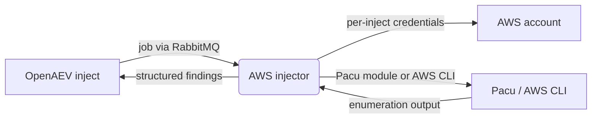

# OpenAEV AWS Injector

The AWS injector lets OpenAEV run cloud security assessments against an AWS account as part of attack scenarios, using
[Pacu](https://github.com/RhinoSecurityLabs/pacu) (the AWS exploitation framework by Rhino Security Labs) together with
the [AWS CLI](https://aws.amazon.com/cli/). It exposes a set of inject contracts that, for a given set of AWS credentials
supplied in the inject, run read-only enumeration modules (IAM, EC2, S3, Lambda, CloudTrail, VPC, RDS and more) plus one
active "IAM Create User" attack action, then report the discovered resources back to OpenAEV as structured findings.

## Table of Contents

- [OpenAEV AWS Injector](#openaev-aws-injector)
  - [Table of Contents](#table-of-contents)
  - [Introduction](#introduction)
  - [How it works](#how-it-works)
  - [Requirements](#requirements)
  - [Configuration variables](#configuration-variables)
    - [OpenAEV environment variables](#openaev-environment-variables)
    - [Base injector environment variables](#base-injector-environment-variables)
  - [Deployment](#deployment)
    - [Docker Deployment](#docker-deployment)
    - [Manual Deployment](#manual-deployment)
  - [Usage](#usage)
  - [Inject contracts](#inject-contracts)
  - [Target selection](#target-selection)
  - [Behavior](#behavior)
  - [Debugging](#debugging)
  - [Additional information](#additional-information)

## Introduction

OpenAEV (Breach and Attack Simulation) drives injectors to execute the technical actions of a scenario. The AWS injector
registers a set of AWS assessment contracts with the OpenAEV platform; when an inject using one of these contracts is
played, OpenAEV dispatches a job to the injector, which runs the corresponding Pacu module or AWS CLI command against the
AWS account behind the credentials provided in the inject, and returns the results.

## How it works

Injectors receive their jobs through the message broker (RabbitMQ) configured by the OpenAEV platform. The injector
fetches the broker connection details from OpenAEV at startup, so it only needs to be able to reach the OpenAEV URL and
the RabbitMQ host/port advertised by the platform.

## Requirements

- A running OpenAEV platform, reachable from the injector (along with its RabbitMQ broker).
- The injector executes the `pacu` and `aws` (AWS CLI) commands. Both are installed as Python dependencies (`pacu` and
  `awscli`, pinned in `pyproject.toml`), so they are bundled in the Docker image and pulled in automatically by
  `poetry install` for a manual deployment - no separate system package is required.
- The Docker image must be built with `--build-context injector_common=../injector_common`, because the injector depends
  on the shared `injector_common` package located one level above this directory.
- For a manual (non-Docker) deployment:
  - Python >= 3.11 and [Poetry](https://python-poetry.org/) >= 2.1.

## Configuration variables

The injector is configured either through environment variables (recommended, read from `docker-compose.yml` / the
`.env` file for a Docker deployment) or through a `config.yml` file (for a manual deployment). Copy the provided
`.env.sample` / `config.yml.sample` and fill in the values flagged with `ChangeMe`.

AWS credentials are not part of the injector configuration: they are supplied per inject (see [Usage](#usage) and
[Target selection](#target-selection)).

### OpenAEV environment variables

| Parameter         | config.yml          | Docker environment variable | Mandatory | Description                                                                        |
|-------------------|---------------------|-----------------------------|-----------|------------------------------------------------------------------------------------|
| OpenAEV URL       | `openaev.url`       | `OPENAEV_URL`               | Yes       | The URL of the OpenAEV platform. Must be reachable from where the injector runs.   |
| OpenAEV Token     | `openaev.token`     | `OPENAEV_TOKEN`             | Yes       | The administrator token of the OpenAEV platform.                                   |
| OpenAEV Tenant ID | `openaev.tenant_id` | `OPENAEV_TENANT_ID`         | No        | Tenant identifier for multi-tenant deployments. When set, it must be a valid UUID. |

### Base injector environment variables

| Parameter     | config.yml           | Docker environment variable | Default | Mandatory | Description                                                     |
|---------------|----------------------|-----------------------------|---------|-----------|-----------------------------------------------------------------|
| Injector ID   | `injector.id`        | `INJECTOR_ID`               | /       | Yes       | A unique `UUIDv4` identifier for this injector instance.        |
| Injector Name | `injector.name`      | `INJECTOR_NAME`             | AWS     | No        | The name of the injector as shown in OpenAEV.                   |
| Log Level     | `injector.log_level` | `INJECTOR_LOG_LEVEL`        | error   | No        | Verbosity of the logs. One of `debug`, `info`, `warn`, `error`. |

## Deployment

### Docker Deployment

This injector depends on the shared `injector_common` package, so the image must be built with a build context that
exposes it:

```shell
docker build --build-context injector_common=../injector_common . -t openaev/injector-aws:latest
```

Create a `.env` file from `.env.sample` and fill in your values, then start the injector with the provided
`docker-compose.yml`:

```shell
docker compose up -d
```

> If OpenAEV runs on your host machine while the injector runs in a container, set `OPENAEV_URL` to
> `http://host.docker.internal:<port>` rather than `localhost`. On Linux, also add
> `extra_hosts: ["host.docker.internal:host-gateway"]` to the service, and make sure OpenAEV listens on `0.0.0.0`.

### Manual Deployment

Create a `config.yml` from `config.yml.sample`, then install and run the injector (the `aws` and `pacu` commands are
provided by the installed Python dependencies):

```shell
poetry install
poetry run python -m aws.openaev_aws
```

> For local development against a checkout of [client-python](https://github.com/OpenAEV-Platform/client-python)
> (cloned next to this repository), use `poetry install --extras dev`.

## Usage

Once started, the injector registers its contracts with OpenAEV and waits for jobs. Add an AWS inject to a scenario or
atomic testing, choose the contract (the AWS module to run) and fill in the credentials of the account to assess, then
play it: the results are attached to the inject once the module completes.

Each inject carries the AWS credentials and parameters used for the run:

| Field                  | Content key             | Mandatory                       | Description                                                                |
|------------------------|-------------------------|---------------------------------|----------------------------------------------------------------------------|
| AWS Access Key ID      | `aws_access_key_id`     | Yes                             | Access key of the AWS account/identity to assess.                          |
| AWS Secret Access Key  | `aws_secret_access_key` | Yes                             | Secret access key paired with the access key.                              |
| AWS Session Token      | `aws_session_token`     | No                              | Session token, for temporary (STS) credentials.                            |
| AWS Region             | `aws_region`            | Yes                             | Target region (default `us-east-1`). All standard, China and GovCloud regions are available. |
| Username to create     | `username`              | Yes (IAM Create User only)      | Name of the IAM user to create.                                            |
| S3 Bucket Name         | `bucket_name`           | Yes (S3 Download Bucket only)   | Name of the bucket whose contents are downloaded.                          |

## Inject contracts

All contracts share the label "AWS Exploitation" and the `CLOUD` security domain. Every contract is read-only
enumeration except "IAM Create User (Attack)", which actively creates an IAM user, and "S3 Download Bucket", which
downloads bucket contents. Most contracts run a Pacu module; a few rely on the AWS CLI.

| AWS service    | Contract(s)                                                                                                              | Engine                                            |
|----------------|--------------------------------------------------------------------------------------------------------------------------|---------------------------------------------------|
| IAM            | IAM Enumerate Permissions; IAM Enumerate Users, Roles, Policies and Groups; IAM Enumerate Roles; IAM Privilege Escalation Scan | Pacu (`iam__*`)                              |
| IAM (AWS CLI)  | IAM Get Account Password Policy; IAM Create User (Attack)                                                                 | AWS CLI (`aws iam get-account-password-policy` / `aws iam create-user`) |
| EC2            | EC2 Enumerate Instances; EC2 Enumerate Security Groups                                                                    | Pacu (`ec2__enum`)                                |
| S3             | S3 List Buckets                                                                                                          | AWS CLI (`aws s3 ls`)                             |
| S3             | S3 Download Bucket                                                                                                       | Pacu (`s3__download_bucket`)                      |
| Lambda         | Lambda Enumerate Functions                                                                                              | Pacu (`lambda__enum`)                             |
| CloudTrail     | CloudTrail Enumerate Trails                                                                                             | Pacu (`cloudtrail__download_event_history`)       |
| VPC            | VPC Enumerate Networks                                                                                                  | Pacu (`vpc__enum_lateral_movement`)               |
| RDS            | RDS Enumerate Databases                                                                                                 | Pacu (`rds__enum`)                                |
| Secrets Manager| Secrets Manager Enumerate                                                                                               | Pacu (`secrets__enum`)                            |
| SSM            | SSM Enumerate Parameters                                                                                                | Pacu (`systemsmanager__download_parameters`)      |
| Organizations  | Organizations Enumerate                                                                                                 | Pacu (`organizations__enum`)                      |
| EBS            | EBS Enumerate Snapshots                                                                                                 | Pacu (`ebs__enum_public_snapshots_unauthenticated`) |
| DynamoDB       | DynamoDB Enumerate Tables                                                                                               | Pacu (`dynamodb__enum`)                           |
| ECR            | ECR Enumerate Repositories                                                                                              | Pacu (`ecr__enum`)                                |
| ECS            | ECS Enumerate Clusters                                                                                                  | Pacu (`ecs__enum`)                                |
| EKS            | EKS Enumerate Clusters                                                                                                  | Pacu (`eks__enum`)                                |
| GuardDuty      | GuardDuty List Findings                                                                                                 | Pacu (`guardduty__list_findings`)                 |
| Cognito        | Cognito Enumerate User Pools                                                                                            | Pacu (`cognito__enum`)                            |
| Glue           | Glue Enumerate Databases                                                                                                | Pacu (`glue__enum`)                               |
| Route53        | Route53 Enumerate Zones                                                                                                 | Pacu (`route53__enum`)                            |
| SNS            | SNS Enumerate Topics                                                                                                    | Pacu (`sns__enum`)                                |

Pacu modules are run through the Pacu CLI in a non-interactive session named `openaev_session`; their textual output is
parsed into the structured findings (users, roles, buckets, instances, etc.) attached to the inject.

## Target selection

This injector does not target OpenAEV assets. The "target" of every inject is the AWS account reached through the
credentials carried by the inject itself: the AWS Access Key ID, AWS Secret Access Key, optional AWS Session Token and
AWS Region. The injector exports these as environment variables for the duration of the run and lets Pacu and the AWS CLI
operate against that account.

As a result, there is no asset / asset-group / manual selector and no target-property mapping. The blast radius of each
inject is whatever the supplied credentials are entitled to do in the selected region.

## Behavior



On each job the injector acknowledges reception, reads the AWS credentials and region from the inject, configures the
AWS environment, resolves the contract to its Pacu module or AWS CLI command, runs it, parses the output into structured
findings, and returns a success or error status to OpenAEV.

## Debugging

Set `INJECTOR_LOG_LEVEL=debug` (or `info`) to log the selected region, the module being executed and the parsing steps.
Common issues:

- Authentication failures (`Unable to locate credentials`, `AccessDenied`): verify the key/secret/token, the region and
  the permissions attached to the identity.
- A module returns no data: the credentials may lack the permissions required by that specific service.

## Additional information

- Pacu documentation: [https://github.com/RhinoSecurityLabs/pacu/wiki](https://github.com/RhinoSecurityLabs/pacu/wiki)
- AWS CLI documentation: [https://docs.aws.amazon.com/cli/](https://docs.aws.amazon.com/cli/)
- Most contracts perform read-only enumeration; use "IAM Create User (Attack)" only against environments where creating
  an IAM user is acceptable.
