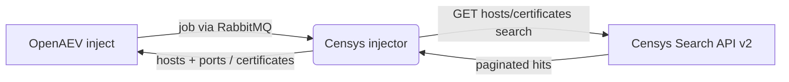

# OpenAEV Censys Injector

The Censys injector lets OpenAEV run external attack-surface OSINT discovery as part of attack scenarios using the
[Censys](https://censys.io/) Search API. It exposes ready-to-use inject contracts (host search and certificate search),
runs the query you provide against the Censys Search API v2, and reports the discovered hosts, open ports and
certificate fingerprints back to OpenAEV as structured findings. It complements the Shodan injector for external
reconnaissance.

## Table of Contents

- [OpenAEV Censys Injector](#openaev-censys-injector)
  - [Table of Contents](#table-of-contents)
  - [Introduction](#introduction)
  - [How it works](#how-it-works)
  - [Requirements](#requirements)
  - [Configuration variables](#configuration-variables)
    - [OpenAEV environment variables](#openaev-environment-variables)
    - [Base injector environment variables](#base-injector-environment-variables)
    - [Censys injector environment variables](#censys-injector-environment-variables)
  - [Deployment](#deployment)
    - [Docker Deployment](#docker-deployment)
    - [Manual Deployment](#manual-deployment)
  - [Usage](#usage)
  - [Inject contracts](#inject-contracts)
  - [Target selection](#target-selection)
  - [Behavior](#behavior)
  - [Debugging](#debugging)
  - [Additional information](#additional-information)

## Introduction

OpenAEV (Breach and Attack Simulation) drives injectors to execute the technical actions of a scenario. The Censys
injector registers a set of discovery contracts with the OpenAEV platform; when an inject using one of these contracts
is played, OpenAEV dispatches a job to the injector, which runs the provided query against the Censys Search API and
returns the results.

## How it works

Injectors receive their jobs through the message broker (RabbitMQ) configured by the OpenAEV platform. The injector
fetches the broker connection details from OpenAEV at startup, so it only needs to be able to reach the OpenAEV URL and
the RabbitMQ host/port advertised by the platform. At execution time, it also needs outbound access to the Censys
Search API.

## Requirements

- A running OpenAEV platform, reachable from the injector (along with its RabbitMQ broker).
- Censys Search API credentials (`CENSYS_API_ID`, `CENSYS_API_SECRET`) and outbound network access to
  `https://search.censys.io`.
- No additional system binaries are required: the Censys API is called with the Python `requests` library.
- The Docker image must be built with `--build-context injector_common=../injector_common`, because the injector depends
  on the shared `injector_common` package located one level above this directory.
- For a manual (non-Docker) deployment:
  - Python >= 3.11 and [Poetry](https://python-poetry.org/) >= 2.1.

## Configuration variables

The injector is configured either through environment variables (recommended, read from `docker-compose.yml` / the
`.env` file for a Docker deployment) or through a `config.yml` file (for a manual deployment). Copy the provided
`.env.sample` / `config.yml.sample` and fill in the values flagged with `ChangeMe`.

### OpenAEV environment variables

| Parameter         | config.yml          | Docker environment variable | Mandatory | Description                                                                        |
|-------------------|---------------------|-----------------------------|-----------|------------------------------------------------------------------------------------|
| OpenAEV URL       | `openaev.url`       | `OPENAEV_URL`               | Yes       | The URL of the OpenAEV platform. Must be reachable from where the injector runs.   |
| OpenAEV Token     | `openaev.token`     | `OPENAEV_TOKEN`             | Yes       | The administrator token of the OpenAEV platform.                                   |
| OpenAEV Tenant ID | `openaev.tenant_id` | `OPENAEV_TENANT_ID`         | No        | Tenant identifier for multi-tenant deployments. When set, it must be a valid UUID. |

### Base injector environment variables

| Parameter     | config.yml           | Docker environment variable | Default | Mandatory | Description                                                     |
|---------------|----------------------|-----------------------------|---------|-----------|-----------------------------------------------------------------|
| Injector ID   | `injector.id`        | `INJECTOR_ID`               | /       | Yes       | A unique `UUIDv4` identifier for this injector instance.        |
| Injector Name | `injector.name`      | `INJECTOR_NAME`             | Censys  | No        | The name of the injector as shown in OpenAEV.                   |
| Log Level     | `injector.log_level` | `INJECTOR_LOG_LEVEL`        | error   | No        | Verbosity of the logs. One of `debug`, `info`, `warn`, `error`. |

### Censys injector environment variables

| Parameter       | config.yml          | Docker environment variable | Default                      | Mandatory | Description                                                                     |
|-----------------|---------------------|-----------------------------|------------------------------|-----------|---------------------------------------------------------------------------------|
| API ID          | `censys.api_id`     | `CENSYS_API_ID`             | /                            | Yes       | Censys Search API ID (operator credential).                                     |
| API Secret      | `censys.api_secret` | `CENSYS_API_SECRET`         | /                            | Yes       | Censys Search API secret (operator credential).                                 |
| Base URL        | `censys.base_url`   | `CENSYS_BASE_URL`           | `https://search.censys.io`   | No        | Base URL of the Censys Search API.                                              |
| Results per page| `censys.per_page`   | `CENSYS_PER_PAGE`           | 50                           | No        | Number of results requested per page (Censys max: 100).                         |
| Max pages       | `censys.max_pages`  | `CENSYS_MAX_PAGES`          | 10                           | No        | Maximum number of result pages to follow via the Censys cursor (bounds usage).  |

> The Censys Search API credentials are injector-level operator credentials configured in `config.yml` / `.env`; they
> are never logged.

## Deployment

### Docker Deployment

This injector depends on the shared `injector_common` package, so the image must be built with a build context that
exposes it:

```shell
docker build --build-context injector_common=../injector_common . -t openaev/injector-censys:latest
```

Create a `.env` file from `.env.sample` and fill in your values (including `CENSYS_API_ID` and `CENSYS_API_SECRET`),
then start the injector with the provided `docker-compose.yml`:

```shell
docker compose up -d
```

> If OpenAEV runs on your host machine while the injector runs in a container, set `OPENAEV_URL` to
> `http://host.docker.internal:<port>` rather than `localhost`. On Linux, also add
> `extra_hosts: ["host.docker.internal:host-gateway"]` to the service, and make sure OpenAEV listens on `0.0.0.0`.

### Manual Deployment

Create a `config.yml` from `config.yml.sample` (set at least `censys.api_id` and `censys.api_secret`), then install and
run the injector:

```shell
poetry install
poetry run python -m censys_injector.openaev_censys
```

> For local development against a checkout of [client-python](https://github.com/OpenAEV-Platform/client-python)
> (cloned next to this repository), use `poetry install --extras dev`.

## Usage

Once started, the injector registers its contracts with OpenAEV and waits for jobs. Add a Censys inject to a scenario or
atomic testing, choose the contract (host search or certificate search), enter a Censys search query, and play it: the
results are attached to the inject once the search completes.

Each contract exposes a single mandatory `Censys search query` field plus expectations. The query uses the standard
[Censys search syntax](https://search.censys.io/search/language), for example `services.service_name: HTTP` for hosts or
`parsed.subject.organization: Example` for certificates.

## Inject contracts

All contracts share the label "Censys" and the `NETWORK` security domain. Each contract issues the corresponding Censys
Search API v2 request and returns finding-compatible outputs.

| Contract                   | Censys API endpoint              | Outputs                                                      |
|----------------------------|----------------------------------|-------------------------------------------------------------|
| Censys - Host search       | `GET /api/v2/hosts/search`       | `hosts` (matching IPv4 addresses), `ports` (distinct ports) |
| Censys - Certificate search| `GET /api/v2/certificates/search`| `certificates` (matching SHA-256 fingerprints)              |

Results are paginated through the Censys cursor: the injector follows the `result.links.next` token up to `max_pages`
pages (with `per_page` results per page) to bound API usage on broad queries.

## Target selection

This injector does not target OpenAEV assets. The "target" of every inject is the Censys search query provided in the
`query` field, so there is no asset / asset-group / manual selector and no target-property mapping. Scope the search
with the Censys query syntax instead.

## Behavior



On each job the injector acknowledges reception, reads the search query from the inject, calls the matching Censys
Search API v2 endpoint (following the cursor across pages), extracts the hosts and ports (host search) or the
certificate fingerprints (certificate search), and returns a structured result together with a success or error status.

## Debugging

Set `INJECTOR_LOG_LEVEL=debug` for more verbose logs. Common issues:

- Authentication failures (`HTTP 401`/`403`): verify `CENSYS_API_ID` and `CENSYS_API_SECRET` and that the account has
  Search API access.
- `HTTP 429 Too Many Requests`: you are exceeding your Censys rate limit; lower `CENSYS_PER_PAGE` / `CENSYS_MAX_PAGES` or
  reduce how often the inject runs.
- No results: confirm the query is valid Censys search syntax for the selected data set (hosts vs. certificates).

## Additional information

- Censys website: [https://censys.io/](https://censys.io/)
- Censys Search API documentation: [https://search.censys.io/api](https://search.censys.io/api)
- Censys search language: [https://search.censys.io/search/language](https://search.censys.io/search/language)
- Create Censys API credentials: [https://search.censys.io/account/api](https://search.censys.io/account/api)
