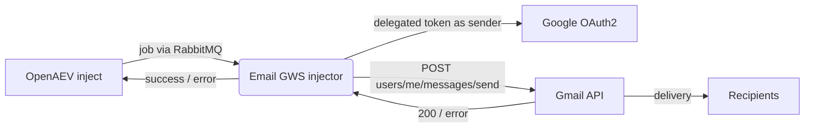

# OpenAEV Email (Google Workspace) Injector

The Email (Google Workspace) injector lets OpenAEV send emails from Google Workspace mailboxes as part of attack
scenarios. It talks to the official [Gmail API](https://developers.google.com/gmail/api/reference/rest/v1/users.messages/send)
(`users.messages.send`) using a Google Cloud **service account** with **domain-wide delegation** - the service account
impersonates a Workspace user (the inject "from" address) and sends as that user, with no SMTP relay and no
less-secure-app access. It exposes a single inject contract carrying the message fields (from, to, cc, bcc, reply-to,
subject, body, body format, attachments) and reports whether Gmail accepted the message.

## Table of Contents

- [OpenAEV Email (Google Workspace) Injector](#openaev-email-google-workspace-injector)
  - [Table of Contents](#table-of-contents)
  - [Introduction](#introduction)
  - [How it works](#how-it-works)
  - [Requirements](#requirements)
  - [Google Workspace setup](#google-workspace-setup)
    - [1. Create a service account and key](#1-create-a-service-account-and-key)
    - [2. Enable the Gmail API](#2-enable-the-gmail-api)
    - [3. Authorize domain-wide delegation](#3-authorize-domain-wide-delegation)
  - [Configuration variables](#configuration-variables)
    - [OpenAEV environment variables](#openaev-environment-variables)
    - [Base injector environment variables](#base-injector-environment-variables)
    - [Google Workspace environment variables](#google-workspace-environment-variables)
  - [Deployment](#deployment)
    - [Docker Deployment](#docker-deployment)
    - [Manual Deployment](#manual-deployment)
  - [Usage](#usage)
  - [Inject contract](#inject-contract)
  - [Behavior](#behavior)
  - [Debugging](#debugging)
  - [Additional information](#additional-information)

## Introduction

OpenAEV (Breach and Attack Simulation) drives injectors to execute the technical actions of a scenario. The Email
(Google Workspace) injector registers a single email contract with the OpenAEV platform; when an inject using this
contract is played, OpenAEV dispatches a job to the injector, which sends the email through the Gmail API and reports
the result.

This is the Google Workspace variant of the OpenAEV email injectors. To send through a raw SMTP server, use the
Email (SMTP) injector; to send through Microsoft 365, use the Email (Microsoft 365) injector (Microsoft Graph API).

## How it works

Injectors receive their jobs through the message broker (RabbitMQ) configured by the OpenAEV platform. The injector
fetches the broker connection details from OpenAEV at startup, so it only needs to be able to reach the OpenAEV URL and
the RabbitMQ host/port advertised by the platform. To deliver a message, the injector also needs outbound HTTPS access
to `oauth2.googleapis.com` (token) and `gmail.googleapis.com` (send).

For each job the injector mints a short-lived OAuth2 access token for the service account impersonating the sender
(domain-wide delegation), builds an RFC 2822 MIME message from the inject content (recipients, subject, HTML or text
body, any attached inject documents), base64url-encodes it, and calls `POST /users/me/messages/send`. The inject is
marked `SUCCESS` when Gmail replies with `200 OK`, otherwise `ERROR` with the Gmail error status.

## Requirements

- A running OpenAEV platform, reachable from the injector (along with its RabbitMQ broker).
- A Google Workspace domain, a Google Cloud service account with a JSON key, and domain-wide delegation authorized for
  the `https://www.googleapis.com/auth/gmail.send` scope - see [Google Workspace setup](#google-workspace-setup).
- Outbound HTTPS access from the injector to `oauth2.googleapis.com` and `gmail.googleapis.com`.
- For a manual (non-Docker) deployment: Python >= 3.11 and [Poetry](https://python-poetry.org/) >= 2.1.

## Google Workspace setup

### 1. Create a service account and key

1. In the [Google Cloud console](https://console.cloud.google.com), create (or reuse) a project.
2. Go to **IAM & Admin > Service accounts > Create service account**.
3. Once created, open the service account > **Keys > Add key > Create new key > JSON** and download the key file. Its
   full JSON content is `GWS_SERVICE_ACCOUNT_JSON`.
4. Note the service account's **Client ID** (a numeric id under **Advanced settings** / the service account details).

### 2. Enable the Gmail API

In the Cloud project, go to **APIs & Services > Library**, search for **Gmail API** and enable it.

### 3. Authorize domain-wide delegation

1. In the [Google Workspace Admin console](https://admin.google.com), go to **Security > Access and data control > API
   controls > Domain-wide delegation > Manage domain-wide delegation**.
2. Click **Add new**, enter the service account **Client ID**, and set the OAuth scope to
   `https://www.googleapis.com/auth/gmail.send`.
3. Click **Authorize**.

> Delegation only works for Google Workspace accounts; you cannot impersonate consumer `@gmail.com` accounts. The
> impersonated user (the inject "from" address) must be a mailbox in your Workspace domain.

## Configuration variables

The injector is configured either through environment variables (recommended, read from `docker-compose.yml` / the
`.env` file for a Docker deployment) or through a `config.yml` file (for a manual deployment). Copy the provided
`.env.sample` / `config.yml.sample` and fill in the values flagged with `ChangeMe`.

### OpenAEV environment variables

| Parameter         | config.yml          | Docker environment variable | Mandatory | Description                                                                        |
|-------------------|---------------------|-----------------------------|-----------|------------------------------------------------------------------------------------|
| OpenAEV URL       | `openaev.url`       | `OPENAEV_URL`               | Yes       | The URL of the OpenAEV platform. Must be reachable from where the injector runs.   |
| OpenAEV Token     | `openaev.token`     | `OPENAEV_TOKEN`             | Yes       | The administrator token of the OpenAEV platform.                                   |
| OpenAEV Tenant ID | `openaev.tenant_id` | `OPENAEV_TENANT_ID`         | No        | Tenant identifier for multi-tenant deployments. When set, it must be a valid UUID. |

### Base injector environment variables

| Parameter     | config.yml           | Docker environment variable | Default                   | Mandatory | Description                                              |
|---------------|----------------------|-----------------------------|---------------------------|-----------|----------------------------------------------------------|
| Injector ID   | `injector.id`        | `INJECTOR_ID`               | /                         | Yes       | A unique `UUIDv4` identifier for this injector instance. |
| Injector Name | `injector.name`      | `INJECTOR_NAME`             | Email (Google Workspace)  | No        | The name of the injector as shown in OpenAEV.            |
| Log Level     | `injector.log_level` | `INJECTOR_LOG_LEVEL`        | info                      | No        | Verbosity: one of `debug`, `info`, `warn`, `error`.      |

### Google Workspace environment variables

| Parameter            | config.yml                    | Docker environment variable     | Default                                    | Mandatory | Description                                                        |
|----------------------|-------------------------------|---------------------------------|--------------------------------------------|-----------|-------------------------------------------------------------------|
| Service account JSON | `gws.service_account_json`    | `GWS_SERVICE_ACCOUNT_JSON`      | /                                          | Yes       | Full service account key JSON with domain-wide delegation.        |
| Gmail base URL       | `gws.gmail_base_url`          | `GWS_GMAIL_BASE_URL`            | `https://gmail.googleapis.com/gmail/v1`    | No        | Base URL of the Gmail API.                                        |
| Request timeout      | `gws.request_timeout_seconds` | `GWS_REQUEST_TIMEOUT_SECONDS`   | `30`                                       | No        | HTTP timeout (seconds) for a single Gmail request.                |

## Deployment

### Docker Deployment

This injector depends on the shared `injector_common` package, so the image must be built with a build context that
exposes it:

```shell
docker build --build-context injector_common=../injector_common . -t openaev/injector-email-google-workspace:latest
```

Create a `.env` file from `.env.sample` and fill in your values, then start the injector with the provided
`docker-compose.yml`:

```shell
docker compose up -d
```

> `GWS_SERVICE_ACCOUNT_JSON` must contain the whole key file as a single value. In an `.env` file, keep it on one line.

> If OpenAEV runs on your host machine while the injector runs in a container, set `OPENAEV_URL` to
> `http://host.docker.internal:<port>` rather than `localhost`. On Linux, also add
> `extra_hosts: ["host.docker.internal:host-gateway"]` to the service, and make sure OpenAEV listens on `0.0.0.0`.

### Manual Deployment

Create a `config.yml` from `config.yml.sample`, then install and run the injector:

```shell
poetry install
poetry run python -m email_gws_injector.openaev_email_gws
```

> For local development against a checkout of [client-python](https://github.com/OpenAEV-Platform/client-python)
> (cloned next to this repository), use `poetry install --extras dev`.

## Usage

Once started, the injector registers its contract with OpenAEV and waits for jobs. Add an Email (Google Workspace)
inject to a scenario or atomic testing, set the sender (a Workspace user) and recipients, pick the body format and play
it: the injector sends the email through the Gmail API and the inject is marked successful once Gmail accepts it.

## Inject contract

The injector registers a single contract labelled "Email (Google Workspace) - Send email" in the `TABLE_TOP` security
domain.

| Field         | Content key   | Mandatory | Description                                                          |
|---------------|---------------|-----------|----------------------------------------------------------------------|
| From          | `from`        | Yes       | Workspace user to impersonate and send as (domain-wide delegation).  |
| To            | `to`          | Yes       | Comma-separated list of primary recipients.                          |
| Cc            | `cc`          | No        | Comma-separated list of Cc recipients.                               |
| Bcc           | `bcc`         | No        | Comma-separated list of Bcc recipients.                              |
| Reply-To      | `reply_to`    | No        | Reply-To header address; omitted when not provided.                  |
| Subject       | `subject`     | Yes       | Subject of the email.                                                |
| Body format   | `body_format` | Yes       | `HTML` (default) or `Plain text`, mapped to the MIME body subtype.   |
| Body          | `body`        | Yes       | Body of the email (HTML or plain text per the format).               |
| Attachments   | `attachments` | No        | Inject documents sent as MIME attachments.                           |

The contract returns no structured outputs. The inject is marked `SUCCESS` when Gmail replies with `200 OK`, and
`ERROR` otherwise (with the Gmail error status, e.g. `PERMISSION_DENIED`, `FAILED_PRECONDITION`).

## Behavior



## Debugging

Set `INJECTOR_LOG_LEVEL=debug` for more verbose logs. Common Gmail issues:

- `Invalid service account JSON`: `GWS_SERVICE_ACCOUNT_JSON` is truncated or not valid JSON - paste the whole key file
  content on one line.
- `PERMISSION_DENIED` / `unauthorized_client`: domain-wide delegation is not authorized for the service account client
  id and the `gmail.send` scope, or the Gmail API is not enabled in the project.
- `FAILED_PRECONDITION` / `forbidden`: the impersonated `from` user is not a Workspace mailbox (consumer `@gmail.com`
  accounts cannot be impersonated), or Gmail is not enabled for that user.

## Additional information

- Gmail `users.messages.send`: [https://developers.google.com/gmail/api/reference/rest/v1/users.messages/send](https://developers.google.com/gmail/api/reference/rest/v1/users.messages/send)
- Service accounts + domain-wide delegation: [https://developers.google.com/identity/protocols/oauth2/service-account](https://developers.google.com/identity/protocols/oauth2/service-account)
- Gmail API scopes: [https://developers.google.com/gmail/api/auth/scopes](https://developers.google.com/gmail/api/auth/scopes)
