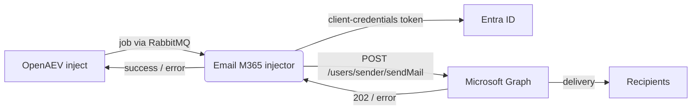

# OpenAEV Email (Microsoft 365) Injector

The Email (Microsoft 365) injector lets OpenAEV send emails from Microsoft 365 mailboxes as part of attack scenarios.
It talks to the official [Microsoft Graph API](https://learn.microsoft.com/en-us/graph/api/user-sendmail) (`sendMail`)
with an Entra ID (Azure AD) application using the OAuth2 client-credentials flow (app-only) - there is no SMTP AUTH and
no signed-in user. It exposes a single inject contract carrying the message fields (from, to, cc, bcc, reply-to,
subject, body, body format, attachments) and reports whether Microsoft Graph accepted the message.

## Table of Contents

- [OpenAEV Email (Microsoft 365) Injector](#openaev-email-microsoft-365-injector)
  - [Table of Contents](#table-of-contents)
  - [Introduction](#introduction)
  - [How it works](#how-it-works)
  - [Requirements](#requirements)
  - [Microsoft 365 app setup](#microsoft-365-app-setup)
    - [1. Register an Entra ID application](#1-register-an-entra-id-application)
    - [2. Add the Mail.Send application permission](#2-add-the-mailsend-application-permission)
    - [3. Create a client secret](#3-create-a-client-secret)
    - [4. (Recommended) Restrict the app to specific mailboxes](#4-recommended-restrict-the-app-to-specific-mailboxes)
  - [Configuration variables](#configuration-variables)
    - [OpenAEV environment variables](#openaev-environment-variables)
    - [Base injector environment variables](#base-injector-environment-variables)
    - [Microsoft 365 environment variables](#microsoft-365-environment-variables)
  - [Deployment](#deployment)
    - [Docker Deployment](#docker-deployment)
    - [Manual Deployment](#manual-deployment)
  - [Usage](#usage)
  - [Inject contract](#inject-contract)
  - [Behavior](#behavior)
  - [Debugging](#debugging)
  - [Additional information](#additional-information)

## Introduction

OpenAEV (Breach and Attack Simulation) drives injectors to execute the technical actions of a scenario. The Email
(Microsoft 365) injector registers a single email contract with the OpenAEV platform; when an inject using this
contract is played, OpenAEV dispatches a job to the injector, which sends the email through Microsoft Graph and reports
the result.

This is the Microsoft 365 variant of the OpenAEV email injectors. To send through a raw SMTP server, use the
Email (SMTP) injector; to send through Google Workspace, use the Email (Google Workspace) injector (Gmail API).

## How it works

Injectors receive their jobs through the message broker (RabbitMQ) configured by the OpenAEV platform. The injector
fetches the broker connection details from OpenAEV at startup, so it only needs to be able to reach the OpenAEV URL and
the RabbitMQ host/port advertised by the platform. To deliver a message, the injector also needs outbound HTTPS access
to `login.microsoftonline.com` (token) and `graph.microsoft.com` (sendMail).

For each job the injector acquires an app-only access token with MSAL (client-credentials flow), builds a Graph
`message` from the inject content (recipients, subject, HTML or text body, any attached inject documents encoded as
`fileAttachment`), and calls `POST /users/{sender}/sendMail`. The inject is marked `SUCCESS` when Graph replies with
`202 Accepted`, otherwise `ERROR` with the Graph error code.

## Requirements

- A running OpenAEV platform, reachable from the injector (along with its RabbitMQ broker).
- A Microsoft 365 tenant and an Entra ID (Azure AD) app registration with the `Mail.Send` application permission
  (admin-consented) - see [Microsoft 365 app setup](#microsoft-365-app-setup).
- Outbound HTTPS access from the injector to `login.microsoftonline.com` and `graph.microsoft.com`.
- For a manual (non-Docker) deployment: Python >= 3.11 and [Poetry](https://python-poetry.org/) >= 2.1.

## Microsoft 365 app setup

### 1. Register an Entra ID application

1. In the [Microsoft Entra admin center](https://entra.microsoft.com), go to **Identity > Applications > App
   registrations > New registration**.
2. Give it a name (e.g. `OpenAEV`), leave the defaults and register. Copy the **Directory (tenant) ID** and the
   **Application (client) ID**.

### 2. Add the Mail.Send application permission

1. Open **API permissions > Add a permission > Microsoft Graph > Application permissions**.
2. Search for and add `Mail.Send`.
3. Click **Grant admin consent** for the tenant (a Global Administrator or Privileged Role Administrator must approve).

> Use **Application** permissions, not Delegated - the injector runs app-only with no signed-in user.

### 3. Create a client secret

1. Open **Certificates & secrets > Client secrets > New client secret**.
2. Copy the secret **Value** (shown once). This is `M365_CLIENT_SECRET`.

### 4. (Recommended) Restrict the app to specific mailboxes

By default `Mail.Send` (Application) lets the app send as any mailbox in the tenant. To limit it, configure an
[application access policy](https://learn.microsoft.com/en-us/graph/auth-limit-mailbox-access) (Exchange Online RBAC for
Applications) scoping the app to a mail-enabled security group.

## Configuration variables

The injector is configured either through environment variables (recommended, read from `docker-compose.yml` / the
`.env` file for a Docker deployment) or through a `config.yml` file (for a manual deployment). Copy the provided
`.env.sample` / `config.yml.sample` and fill in the values flagged with `ChangeMe`.

### OpenAEV environment variables

| Parameter         | config.yml          | Docker environment variable | Mandatory | Description                                                                        |
|-------------------|---------------------|-----------------------------|-----------|------------------------------------------------------------------------------------|
| OpenAEV URL       | `openaev.url`       | `OPENAEV_URL`               | Yes       | The URL of the OpenAEV platform. Must be reachable from where the injector runs.   |
| OpenAEV Token     | `openaev.token`     | `OPENAEV_TOKEN`             | Yes       | The administrator token of the OpenAEV platform.                                   |
| OpenAEV Tenant ID | `openaev.tenant_id` | `OPENAEV_TENANT_ID`         | No        | Tenant identifier for multi-tenant deployments. When set, it must be a valid UUID. |

### Base injector environment variables

| Parameter     | config.yml           | Docker environment variable | Default              | Mandatory | Description                                              |
|---------------|----------------------|-----------------------------|----------------------|-----------|----------------------------------------------------------|
| Injector ID   | `injector.id`        | `INJECTOR_ID`               | /                    | Yes       | A unique `UUIDv4` identifier for this injector instance. |
| Injector Name | `injector.name`      | `INJECTOR_NAME`             | Email (Microsoft 365) | No       | The name of the injector as shown in OpenAEV.            |
| Log Level     | `injector.log_level` | `INJECTOR_LOG_LEVEL`        | info                 | No        | Verbosity: one of `debug`, `info`, `warn`, `error`.      |

### Microsoft 365 environment variables

| Parameter       | config.yml                     | Docker environment variable      | Default                              | Mandatory | Description                                              |
|-----------------|--------------------------------|----------------------------------|--------------------------------------|-----------|----------------------------------------------------------|
| Tenant ID       | `m365.tenant_id`               | `M365_TENANT_ID`                 | /                                    | Yes       | Entra ID (Azure AD) tenant id (GUID).                    |
| Client ID       | `m365.client_id`               | `M365_CLIENT_ID`                 | /                                    | Yes       | Application (client) id of the app registration.         |
| Client Secret   | `m365.client_secret`           | `M365_CLIENT_SECRET`             | /                                    | Yes       | Client secret of the app registration.                   |
| Graph base URL  | `m365.graph_base_url`          | `M365_GRAPH_BASE_URL`            | `https://graph.microsoft.com/v1.0`   | No        | Base URL of the Microsoft Graph API.                     |
| Authority URL   | `m365.authority_base_url`      | `M365_AUTHORITY_BASE_URL`        | `https://login.microsoftonline.com`  | No        | Base URL of the Microsoft identity platform.             |
| Request timeout | `m365.request_timeout_seconds` | `M365_REQUEST_TIMEOUT_SECONDS`   | `30`                                 | No        | HTTP timeout (seconds) for a single Graph request.       |

## Deployment

### Docker Deployment

This injector depends on the shared `injector_common` package, so the image must be built with a build context that
exposes it:

```shell
docker build --build-context injector_common=../injector_common . -t openaev/injector-email-m365:latest
```

Create a `.env` file from `.env.sample` and fill in your values, then start the injector with the provided
`docker-compose.yml`:

```shell
docker compose up -d
```

> If OpenAEV runs on your host machine while the injector runs in a container, set `OPENAEV_URL` to
> `http://host.docker.internal:<port>` rather than `localhost`. On Linux, also add
> `extra_hosts: ["host.docker.internal:host-gateway"]` to the service, and make sure OpenAEV listens on `0.0.0.0`.

### Manual Deployment

Create a `config.yml` from `config.yml.sample`, then install and run the injector:

```shell
poetry install
poetry run python -m email_m365_injector.openaev_email_m365
```

> For local development against a checkout of [client-python](https://github.com/OpenAEV-Platform/client-python)
> (cloned next to this repository), use `poetry install --extras dev`.

## Usage

Once started, the injector registers its contract with OpenAEV and waits for jobs. Add an Email (Microsoft 365) inject
to a scenario or atomic testing, set the sender mailbox and recipients, pick the body format and play it: the injector
sends the email through Microsoft Graph and the inject is marked successful once Graph accepts it (`202 Accepted`).

## Inject contract

The injector registers a single contract labelled "Email (Microsoft 365) - Send email" in the `TABLE_TOP` security
domain.

| Field         | Content key    | Mandatory | Description                                                          |
|---------------|----------------|-----------|----------------------------------------------------------------------|
| From          | `from`         | Yes       | Sender mailbox in the tenant (used both as sender and Graph path).   |
| To            | `to`           | Yes       | Comma-separated list of primary recipients.                          |
| Cc            | `cc`           | No        | Comma-separated list of Cc recipients.                               |
| Bcc           | `bcc`          | No        | Comma-separated list of Bcc recipients.                              |
| Reply-To      | `reply_to`     | No        | Reply-To header address; omitted when not provided.                  |
| Subject       | `subject`      | Yes       | Subject of the email.                                                |
| Body format   | `body_format`  | Yes       | `HTML` (default) or `Plain text`, mapped to Graph `contentType`.     |
| Body          | `body`         | Yes       | Body of the email (HTML or plain text per the format).               |
| Save to Sent  | `save_to_sent` | No        | Whether Graph stores the message in the sender's Sent Items.         |
| Attachments   | `attachments`  | No        | Inject documents sent as Graph `fileAttachment` items.               |

The contract returns no structured outputs. The inject is marked `SUCCESS` when Graph replies with `202 Accepted`, and
`ERROR` otherwise (with the Graph error code, e.g. `ErrorAccessDenied`, `ErrorInvalidUser`).

## Behavior



## Debugging

Set `INJECTOR_LOG_LEVEL=debug` for more verbose logs. Common Microsoft Graph issues:

- `invalid_client` / token errors: the client id/secret or tenant id is wrong or the secret expired - re-check the app
  registration and `M365_CLIENT_SECRET`.
- `ErrorAccessDenied`: the `Mail.Send` application permission is missing or admin consent was not granted, or an
  application access policy blocks the sender mailbox.
- `ErrorInvalidUser` / `MailboxNotEnabledForRESTAPI`: the `from` mailbox does not exist or is not a licensed Exchange
  Online mailbox.

## Additional information

- Microsoft Graph `sendMail`: [https://learn.microsoft.com/en-us/graph/api/user-sendmail](https://learn.microsoft.com/en-us/graph/api/user-sendmail)
- Client-credentials flow: [https://learn.microsoft.com/en-us/graph/auth-v2-service](https://learn.microsoft.com/en-us/graph/auth-v2-service)
- Limit mailbox access: [https://learn.microsoft.com/en-us/graph/auth-limit-mailbox-access](https://learn.microsoft.com/en-us/graph/auth-limit-mailbox-access)
