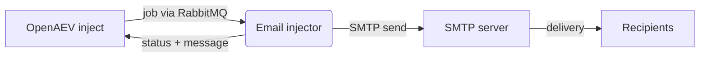

# OpenAEV Email (SMTP) Injector

The Email (SMTP) injector lets OpenAEV craft and send emails over SMTP as part of attack scenarios. It exposes a single
inject contract carrying the SMTP connection settings and the message fields (from, to, cc, bcc, subject, body,
attachments), sends the email with the Python standard library (`smtplib`), and reports the result back to OpenAEV.

## Table of Contents

- [OpenAEV Email (SMTP) Injector](#openaev-email-smtp-injector)
  - [Table of Contents](#table-of-contents)
  - [Introduction](#introduction)
  - [How it works](#how-it-works)
  - [Requirements](#requirements)
  - [Configuration variables](#configuration-variables)
    - [OpenAEV environment variables](#openaev-environment-variables)
    - [Base injector environment variables](#base-injector-environment-variables)
  - [Deployment](#deployment)
    - [Docker Deployment](#docker-deployment)
    - [Manual Deployment](#manual-deployment)
  - [Usage](#usage)
  - [Inject contracts](#inject-contracts)
  - [Target selection](#target-selection)
  - [Behavior](#behavior)
  - [Debugging](#debugging)

## Introduction

OpenAEV (Breach and Attack Simulation) drives injectors to execute the technical actions of a scenario. The Email
injector registers an email contract with the OpenAEV platform; when an inject using this contract is played, OpenAEV
dispatches a job to the injector, which sends the corresponding email through the SMTP server defined in the inject
and returns the result.

> This is the SMTP variant of the OpenAEV email injectors. To send through a managed provider API instead, see the
> Email (Microsoft 365) injector (Microsoft Graph API) and the Email (Google Workspace) injector (Gmail API).

## How it works

Injectors receive their jobs through the message broker (RabbitMQ) configured by the OpenAEV platform. The injector
fetches the broker connection details from OpenAEV at startup, so it only needs to be able to reach the OpenAEV URL
and the RabbitMQ host/port advertised by the platform.

## Requirements

- A running OpenAEV platform, reachable from the injector (along with its RabbitMQ broker).
- Network access from the injector to the SMTP servers referenced by the injects.
- No additional system binaries are required: emails are sent with the Python standard library (`smtplib`).
- The Docker image must be built with `--build-context injector_common=../injector_common`, because the injector
  depends on the shared `injector_common` package located one level above this directory.
- For a manual (non-Docker) deployment:
  - Python >= 3.11 and [Poetry](https://python-poetry.org/) >= 2.1.

## Configuration variables

The injector is configured either through environment variables (recommended, read from `docker-compose.yml` / the
`.env` file for a Docker deployment) or through a `config.yml` file (for a manual deployment). Copy the provided
`.env.sample` / `config.yml.sample` and fill in the values flagged with `ChangeMe`.

### OpenAEV environment variables

| Parameter         | config.yml          | Docker environment variable | Mandatory | Description                                                                        |
|-------------------|---------------------|-----------------------------|-----------|------------------------------------------------------------------------------------|
| OpenAEV URL       | `openaev.url`       | `OPENAEV_URL`               | Yes       | The URL of the OpenAEV platform. Must be reachable from where the injector runs.   |
| OpenAEV Token     | `openaev.token`     | `OPENAEV_TOKEN`             | Yes       | The administrator token of the OpenAEV platform.                                   |
| OpenAEV Tenant ID | `openaev.tenant_id` | `OPENAEV_TENANT_ID`         | No        | Tenant identifier for multi-tenant deployments. When set, it must be a valid UUID. |

### Base injector environment variables

| Parameter     | config.yml           | Docker environment variable | Default      | Mandatory | Description                                                                    |
|---------------|----------------------|-----------------------------|--------------|-----------|--------------------------------------------------------------------------------|
| Injector ID   | `injector.id`        | `INJECTOR_ID`               | /            | Yes       | A unique `UUIDv4` identifier for this injector instance.                       |
| Injector Name | `injector.name`      | `INJECTOR_NAME`             | Email (SMTP) | No        | The name of the injector as shown in OpenAEV.                                  |
| Log Level     | `injector.log_level` | `INJECTOR_LOG_LEVEL`        | error        | No        | Verbosity of the logs. One of `debug`, `info`, `warning`, `error`, `critical`. |

## Deployment

### Docker Deployment

This injector depends on the shared `injector_common` package, so the image must be built with a build context that
exposes it:

```shell
docker build --build-context injector_common=../injector_common . -t openaev/injector-email-smtp:latest
```

Create a `.env` file from `.env.sample` and fill in your values, then start the injector with the provided
`docker-compose.yml`:

```shell
docker compose up -d
```

> If OpenAEV runs on your host machine while the injector runs in a container, set `OPENAEV_URL` to
> `http://host.docker.internal:<port>` rather than `localhost`. On Linux, also add
> `extra_hosts: ["host.docker.internal:host-gateway"]` to the service, and make sure OpenAEV listens on `0.0.0.0`.

### Manual Deployment

Create a `config.yml` from `config.yml.sample`, then install and run the injector:

```shell
poetry install
poetry run python -m email_smtp_injector.openaev_email_smtp
```

> For local development against a checkout of [client-python](https://github.com/OpenAEV-Platform/client-python)
> (cloned next to this repository), use `poetry install --extras dev`.

## Usage

`config.yml` only contains OpenAEV and injector runtime settings:

```yaml
injector:
  id: 'changeme'
  name: 'Email (SMTP)'
  log_level: 'info'
```

Injects carry the message-specific fields: `from`, optional `mail_from`
(SMTP envelope sender), optional `reply_to`, `to`, `subject`, `body`, optional
`cc` and `bcc` (comma-separated email lists), and SMTP fields:
`smtp_hostname`, `smtp_port`, `smtp_use_tls`, `smtp_username`,
`smtp_password`. They can also carry optional attachments through the
contract attachment field.

## Inject contracts

The injector registers a single contract labelled "Email (SMTP) - Craft email" in the `TABLE_TOP` security domain.

| Field         | Content key     | Mandatory | Description                                                     |
|---------------|-----------------|-----------|-----------------------------------------------------------------|
| SMTP Hostname | `smtp_hostname` | Yes       | Hostname of the SMTP server used to send the email.             |
| SMTP Port     | `smtp_port`     | Yes       | Port of the SMTP server.                                        |
| Use TLS       | `smtp_use_tls`  | No        | Enables STARTTLS on the SMTP connection.                        |
| SMTP Username | `smtp_username` | No        | SMTP authentication username (used together with the password). |
| SMTP Password | `smtp_password` | No        | SMTP authentication password.                                   |
| From Email    | `from`          | Yes       | Sender address of the email.                                    |
| Mail From     | `mail_from`     | No        | SMTP envelope sender (MAIL FROM); defaults to `from`.           |
| Reply-To      | `reply_to`      | No        | Reply-To header address; omitted when not provided.             |
| To Email      | `to`            | Yes       | Primary recipient address.                                      |
| Cc            | `cc`            | No        | Comma-separated list of Cc recipients.                          |
| Bcc           | `bcc`           | No        | Comma-separated list of Bcc recipients.                         |
| Subject       | `subject`       | Yes       | Subject of the email.                                           |
| Body          | `body`          | Yes       | Plain-text body of the email.                                   |
| Attachments   | `attachments`   | No        | Inject documents sent as email attachments.                     |

## Target selection

This injector does not target OpenAEV assets. The "target" of every inject is the recipient list provided in the
`to` / `cc` / `bcc` fields, so there is no asset / asset-group selector and no target-property mapping.

## Behavior



On each job the injector acknowledges reception, builds the MIME message (adding Cc, Bcc and any attached inject
documents), connects to the SMTP server defined in the inject (with STARTTLS and authentication when configured),
sends the email, and returns a success or error status to OpenAEV.

## Debugging

Set `INJECTOR_LOG_LEVEL=debug` to get more verbose logs. Common issues:

- Connection errors or timeouts: confirm the SMTP hostname and port are reachable from where the injector runs.
- Authentication errors: re-check the SMTP username / password and whether the server requires STARTTLS
  (`smtp_use_tls`).
