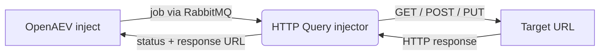

# OpenAEV HTTP Query Injector

The HTTP Query injector lets OpenAEV perform arbitrary HTTP requests as part of attack scenarios. It exposes ready-to-use
inject contracts (GET, POST and PUT, with a raw or key/value body), supports optional basic authentication, custom
headers and file attachments, sends the request with the Python [requests](https://requests.readthedocs.io/) library,
and reports the response status back to OpenAEV.

## Table of Contents

- [OpenAEV HTTP Query Injector](#openaev-http-query-injector)
  - [Table of Contents](#table-of-contents)
  - [Introduction](#introduction)
  - [How it works](#how-it-works)
  - [Requirements](#requirements)
  - [Configuration variables](#configuration-variables)
    - [OpenAEV environment variables](#openaev-environment-variables)
    - [Base injector environment variables](#base-injector-environment-variables)
  - [Deployment](#deployment)
    - [Docker Deployment](#docker-deployment)
    - [Manual Deployment](#manual-deployment)
  - [Usage](#usage)
  - [Inject contracts](#inject-contracts)
  - [Target selection](#target-selection)
  - [Behavior](#behavior)
  - [Debugging](#debugging)
  - [Additional information](#additional-information)

## Introduction

OpenAEV (Breach and Attack Simulation) drives injectors to execute the technical actions of a scenario. The HTTP Query
injector registers a set of HTTP request contracts with the OpenAEV platform; when an inject using one of these contracts
is played, OpenAEV dispatches a job to the injector, which performs the corresponding HTTP request and returns the result.

## How it works

Injectors receive their jobs through the message broker (RabbitMQ) configured by the OpenAEV platform. The injector
fetches the broker connection details from OpenAEV at startup, so it only needs to be able to reach the OpenAEV URL and
the RabbitMQ host/port advertised by the platform.

## Requirements

- A running OpenAEV platform, reachable from the injector (along with its RabbitMQ broker).
- The injector also needs network access to the URLs it is asked to call.
- No additional system binaries are required: the HTTP requests are made with the Python `requests` library.
- The Docker image must be built with `--build-context injector_common=../injector_common`, because the injector depends
  on the shared `injector_common` package located one level above this directory.
- For a manual (non-Docker) deployment:
  - Python >= 3.11 and [Poetry](https://python-poetry.org/) >= 2.1.

## Configuration variables

The injector is configured either through environment variables (recommended, read from `docker-compose.yml` / the
`.env` file for a Docker deployment) or through a `config.yml` file (for a manual deployment). Copy the provided
`.env.sample` / `config.yml.sample` and fill in the values flagged with `ChangeMe`.

### OpenAEV environment variables

| Parameter         | config.yml          | Docker environment variable | Mandatory | Description                                                                        |
|-------------------|---------------------|-----------------------------|-----------|------------------------------------------------------------------------------------|
| OpenAEV URL       | `openaev.url`       | `OPENAEV_URL`               | Yes       | The URL of the OpenAEV platform. Must be reachable from where the injector runs.   |
| OpenAEV Token     | `openaev.token`     | `OPENAEV_TOKEN`             | Yes       | The administrator token of the OpenAEV platform.                                   |
| OpenAEV Tenant ID | `openaev.tenant_id` | `OPENAEV_TENANT_ID`         | No        | Tenant identifier for multi-tenant deployments. When set, it must be a valid UUID. |

### Base injector environment variables

| Parameter     | config.yml           | Docker environment variable | Default    | Mandatory | Description                                                     |
|---------------|----------------------|-----------------------------|------------|-----------|-----------------------------------------------------------------|
| Injector ID   | `injector.id`        | `INJECTOR_ID`               | /          | Yes       | A unique `UUIDv4` identifier for this injector instance.        |
| Injector Name | `injector.name`      | `INJECTOR_NAME`             | HTTP query | No        | The name of the injector as shown in OpenAEV.                   |
| Log Level     | `injector.log_level` | `INJECTOR_LOG_LEVEL`        | error      | No        | Verbosity of the logs. One of `debug`, `info`, `warn`, `error`. |

## Deployment

### Docker Deployment

This injector depends on the shared `injector_common` package, so the image must be built with a build context that
exposes it:

```shell
docker build --build-context injector_common=../injector_common . -t openaev/injector-http-query:latest
```

Create a `.env` file from `.env.sample` and fill in your values, then start the injector with the provided
`docker-compose.yml`:

```shell
docker compose up -d
```

> If OpenAEV runs on your host machine while the injector runs in a container, set `OPENAEV_URL` to
> `http://host.docker.internal:<port>` rather than `localhost`. On Linux, also add
> `extra_hosts: ["host.docker.internal:host-gateway"]` to the service, and make sure OpenAEV listens on `0.0.0.0`.

### Manual Deployment

Create a `config.yml` from `config.yml.sample`, then install and run the injector:

```shell
poetry install
poetry run python -m http_query.openaev_http
```

> For local development against a checkout of [client-python](https://github.com/OpenAEV-Platform/client-python)
> (cloned next to this repository), use `poetry install --extras dev`.

## Usage

Once started, the injector registers its contracts with OpenAEV and waits for jobs. Add an HTTP Request inject to a
scenario or atomic testing, choose the method (GET, POST or PUT), set the URL and any optional authentication, headers,
body or attachments, then play it: the response status is attached to the inject once the request completes.

The fields available across the contracts are:

| Field                      | Content key     | Mandatory                       | Description                                                                  |
|----------------------------|-----------------|---------------------------------|------------------------------------------------------------------------------|
| URL                        | `uri`           | Yes                             | The target URL of the request.                                               |
| Use basic authentication   | `basicAuth`     | No                              | Enables HTTP basic authentication.                                           |
| Username                   | `basicUser`     | When basic auth is enabled      | Basic-auth username.                                                         |
| Password                   | `basicPassword` | When basic auth is enabled      | Basic-auth password.                                                         |
| Headers                    | `headers`       | No                              | Custom request headers (see format below).                                   |
| Raw request data           | `body`          | Yes (raw-body contracts)        | Raw request body sent as-is.                                                 |
| Form request data          | `parts`         | No (key/value contracts)        | Form fields sent as a key/value body (see format below).                     |
| Attachments                | `attachments`   | No (key/value contracts)        | Inject documents sent as multipart file uploads.                             |

Headers are expressed as `key=value` pairs separated by commas (whitespace inside keys and values is preserved):

```plaintext
content-type=application/json,x-custom-header=value for the header
```

Form request data (the key/value body) is expressed as `key=value` pairs separated by `&`:

```plaintext
field1=value1&field2=value2
```

## Inject contracts

All contracts share the label "HTTP Request" and the `WEB_APP` security domain. Each one returns the final request URL
as a structured output.

| Contract                          | HTTP method | Body                                                    |
|-----------------------------------|-------------|---------------------------------------------------------|
| HTTP Request - GET                | GET         | None                                                    |
| HTTP Request - POST (raw body)    | POST        | Raw body from the `body` field                          |
| HTTP Request - PUT (raw body)     | PUT         | Raw body from the `body` field                          |
| HTTP Request - POST (key/value)   | POST        | Form key/value body from `parts` (+ optional attachments) |
| HTTP Request - PUT (key/value)    | PUT         | Form key/value body from `parts` (+ optional attachments) |

For the POST and PUT contracts, any inject documents flagged as attached are downloaded from OpenAEV and sent as
multipart file uploads alongside the body.

## Target selection

This injector does not target OpenAEV assets. The "target" of every inject is the URL provided in the `uri` field, so
there is no asset / asset-group / manual selector and no target-property mapping. Point the request at any endpoint
reachable from where the injector runs.

## Behavior



On each job the injector acknowledges reception, builds a `requests` session (adding basic auth and headers when set),
sends the GET, POST or PUT request for the selected contract, and returns the response (final URL and body) together with
a success or error status.

## Debugging

Set `INJECTOR_LOG_LEVEL=debug` to get more verbose logs. Common issues:

- Connection or DNS errors: confirm the target URL is reachable from where the injector runs.
- Unexpected `400`/`401`/`405` responses: re-check the method, the headers format (`key=value` comma-separated) and the
  basic-auth credentials.

## Additional information

- Contracts cover GET, POST and PUT; both a raw body and a key/value (form) body are supported for POST and PUT.
- The structured output of each inject is the final request URL; the full response body is returned in the execution
  message.
