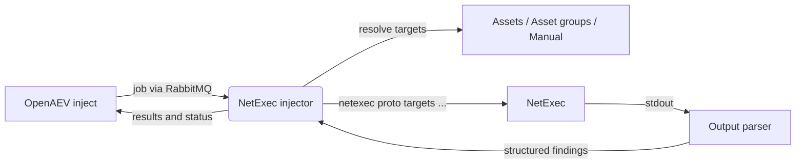

# OpenAEV NetExec Injector

The NetExec injector lets OpenAEV run network execution and credential-testing actions as part of attack scenarios using
[NetExec](https://www.netexec.wiki/) (the maintained successor to CrackMapExec). It exposes inject contracts across many
protocols (SMB, SSH, LDAP, WinRM, MSSQL, RDP, VNC, FTP, WMI and NFS), resolves the targets from your OpenAEV assets or
from manual input, builds and runs the corresponding `netexec` command, and reports the output (and structured findings)
back to OpenAEV.

## Table of Contents

- [OpenAEV NetExec Injector](#openaev-netexec-injector)
  - [Table of Contents](#table-of-contents)
  - [Introduction](#introduction)
  - [How it works](#how-it-works)
  - [Requirements](#requirements)
  - [Configuration variables](#configuration-variables)
    - [OpenAEV environment variables](#openaev-environment-variables)
    - [Base injector environment variables](#base-injector-environment-variables)
  - [Deployment](#deployment)
    - [Docker Deployment](#docker-deployment)
    - [Manual Deployment](#manual-deployment)
  - [Usage](#usage)
  - [Inject contracts](#inject-contracts)
  - [Target selection](#target-selection)
  - [Behavior](#behavior)
  - [Debugging](#debugging)
  - [Additional information](#additional-information)

## Introduction

OpenAEV (Breach and Attack Simulation) drives injectors to execute the technical actions of a scenario. The NetExec
injector registers a large set of protocol contracts with the OpenAEV platform; when an inject using one of these
contracts is played, OpenAEV dispatches a job to the injector, which builds and runs the matching NetExec command
against the resolved targets and returns the results.

## How it works

Injectors receive their jobs through the message broker (RabbitMQ) configured by the OpenAEV platform. The injector
fetches the broker connection details from OpenAEV at startup, so it only needs to be able to reach the OpenAEV URL and
the RabbitMQ host/port advertised by the platform.

## Requirements

- A running OpenAEV platform, reachable from the injector (along with its RabbitMQ broker).
- The `netexec` binary must be available on the `PATH`. The Docker image installs it from source
  (`pip install git+https://github.com/Pennyw0rth/NetExec.git`); the image build also pulls the toolchain NetExec needs
  to compile its native dependencies (`gcc`, `musl-dev`, `libffi-dev`, `openssl-dev`, `cargo`, `git`).
- The Docker image must be built with `--build-context injector_common=../injector_common`, because the injector depends
  on the shared `injector_common` package located one level above this directory.
- For a manual (non-Docker) deployment:
  - Python >= 3.11 and [Poetry](https://python-poetry.org/) >= 2.1.
  - NetExec installed and reachable as `netexec` (see
    [the NetExec installation guide](https://www.netexec.wiki/getting-started/installation)).

## Configuration variables

The injector is configured either through environment variables (recommended, read from `docker-compose.yml` / the
`.env` file for a Docker deployment) or through a `config.yml` file (for a manual deployment). Copy the provided
`.env.sample` / `config.yml.sample` and fill in the values flagged with `ChangeMe`.

### OpenAEV environment variables

| Parameter         | config.yml          | Docker environment variable | Mandatory | Description                                                                        |
|-------------------|---------------------|-----------------------------|-----------|------------------------------------------------------------------------------------|
| OpenAEV URL       | `openaev.url`       | `OPENAEV_URL`               | Yes       | The URL of the OpenAEV platform. Must be reachable from where the injector runs.   |
| OpenAEV Token     | `openaev.token`     | `OPENAEV_TOKEN`             | Yes       | The administrator token of the OpenAEV platform.                                   |
| OpenAEV Tenant ID | `openaev.tenant_id` | `OPENAEV_TENANT_ID`         | No        | Tenant identifier for multi-tenant deployments. When set, it must be a valid UUID. |

### Base injector environment variables

| Parameter     | config.yml           | Docker environment variable | Default | Mandatory | Description                                                     |
|---------------|----------------------|-----------------------------|---------|-----------|-----------------------------------------------------------------|
| Injector ID   | `injector.id`        | `INJECTOR_ID`               | /       | Yes       | A unique `UUIDv4` identifier for this injector instance.        |
| Injector Name | `injector.name`      | `INJECTOR_NAME`             | NetExec | No        | The name of the injector as shown in OpenAEV.                   |
| Log Level     | `injector.log_level` | `INJECTOR_LOG_LEVEL`        | info    | No        | Verbosity of the logs. One of `debug`, `info`, `warn`, `error`. |

Credentials supplied per inject (usernames, passwords, hashes, domains, key files) are never written to the logs: they
are redacted before any logging or callback message is sent.

## Deployment

### Docker Deployment

This injector depends on the shared `injector_common` package, so the image must be built with a build context that
exposes it:

```shell
docker build --build-context injector_common=../injector_common . -t openaev/injector-netexec:latest
```

Create a `.env` file from `.env.sample` and fill in your values, then start the injector with the provided
`docker-compose.yml`:

```shell
docker compose up -d
```

> The Docker image already bundles NetExec, so no further installation is needed inside the container.

> If OpenAEV runs on your host machine while the injector runs in a container, set `OPENAEV_URL` to
> `http://host.docker.internal:<port>` rather than `localhost`. On Linux, also add
> `extra_hosts: ["host.docker.internal:host-gateway"]` to the service, and make sure OpenAEV listens on `0.0.0.0`.

### Manual Deployment

Make sure `netexec` is installed and on your `PATH`, create a `config.yml` from `config.yml.sample`, then install and
run the injector:

```shell
poetry install
poetry run python -m netexec.openaev_netexec
```

> For local development against a checkout of [client-python](https://github.com/OpenAEV-Platform/client-python)
> (cloned next to this repository), use `poetry install --extras dev`.

## Usage

Once started, the injector registers its contracts with OpenAEV and waits for jobs. Add a NetExec inject to a scenario
or atomic testing, pick the protocol contract (and, if relevant, the option or module variant), set the targets and the
credentials, then play it: the command output and structured findings are attached to the inject once it completes.

At startup the injector logs the detected NetExec version (`netexec --version`).

## Inject contracts

Contracts are generated for each supported protocol and come in three families. The contract ID encodes the family:

- `netexec_<protocol>` - base protocol contract (the bare authentication check, optionally with a command to execute).
- `netexec_<protocol>_opt_<option_id>` - protocol + option contract (adds one NetExec flag, e.g. `--shares`).
- `netexec_<protocol>_mod_<module>` - protocol + module contract (runs a NetExec module with `-M <module>`).

All contracts share the label prefix "NetExec" and the `ENDPOINT` / `NETWORK` security domains. Every contract also
exposes the shared target selector, the protocol credentials, an optional `port` override, and expectations. The
following protocols are available:

| Protocol | Default port | Credentials accepted                | Command-execution fields                          | Number of option contracts |
|----------|--------------|-------------------------------------|---------------------------------------------------|-----------------------------|
| SMB      | 445          | username, password, NTLM hash, domain | `-x` (command), `-X` (PowerShell)               | 14                          |
| SSH      | 22           | username, password, SSH key file      | `-x` (command)                                  | 2                           |
| LDAP     | 389          | username, password, NTLM hash, domain | -                                               | 14                          |
| WinRM    | 5985         | username, password, NTLM hash, domain | `-x` (command), `-X` (PowerShell)               | 4                           |
| MSSQL    | 1433         | username, password, NTLM hash, domain | `-q` (SQL), `-x` (command), `-X` (PowerShell)   | 3                           |
| RDP      | 3389         | username, password, NTLM hash, domain | `-x` (command), `-X` (PowerShell)               | 3                           |
| VNC      | 5900         | password                              | -                                               | 1                           |
| FTP      | 21           | username, password                    | -                                               | 1                           |
| WMI      | 135          | username, password, NTLM hash, domain | `-x` (command), `-X` (PowerShell), `--wmi-query` | 2                          |
| NFS      | 111          | -                                     | -                                               | 3                           |

Option contracts add a single flag on top of the base protocol contract. The available options per protocol are:

- SMB: `--shares`, `--pass-pol`, `--users`, `--groups`, `--local-groups`, `--loggedon-users`, `--computers`,
  `--rid-brute`, `--disks`, `--interfaces`, `--local-auth`, `--sam`, `--lsa`, `--ntds`
- SSH: `--sudo-check`, `--no-output`
- LDAP: `--users`, `--groups`, `--computers`, `--dc-list`, `--get-sid`, `--active-users`, `--trusted-for-delegation`,
  `--find-delegation`, `--password-not-required`, `--admin-count`, `--gmsa`, `--asreproast`, `--kerberoasting`,
  `--bloodhound`
- WinRM: `--local-auth`, `--sam`, `--lsa`, `--no-output`
- MSSQL: `--local-auth`, `--rid-brute`, `--no-output`
- RDP: `--local-auth`, `--screenshot`, `--nla-screenshot`
- VNC: `--screenshot`
- FTP: `--ls`
- WMI: `--local-auth`, `--no-output`
- NFS: `--shares`, `--enum-shares`, `--ls`

> The `--asreproast` and `--kerberoasting` LDAP options write their results to an auto-generated temporary file, which is
> read back into the inject output and then removed.

Module contracts wrap the NetExec module catalogue (`add-computer`, `lsassy`, `ntdsutil`, `spider_plus`, `zerologon`,
`ms17-010`, ...). One contract is generated per (protocol, module) pair the module supports, and each module exposes its
own option fields (mapped to `-o KEY=VALUE`) plus a free-text "Additional module options" field. Because there are many
such combinations, browse them directly in OpenAEV rather than listing every one here.

The command the injector builds follows this shape:

```shell
netexec <protocol> <targets> [-u <user>] [-p <password>] [-H <hash>] [-d <domain>] [--key-file <path>] \
        [--port <port>] [<option flag>] [-x "<command>"] [-M <module> -o KEY=VALUE ...]
```

## Target selection

Targets are resolved through the shared selection logic of `injector_common`:

- Target selector: `assets`, `asset-groups` (default), or `manual`.
- Target property selector (for assets / asset groups): `automatic` (default), `seen_ip`, `local_ip` (first), or
  `hostname`.

| Target property   | Asset field used                                   |
|-------------------|----------------------------------------------------|
| Automatic         | Hostname for agentless assets, else first valid IP |
| Seen IP           | `asset_seen_ip`                                    |
| Local IP (first)  | First valid entry in `asset_ips`                   |
| Hostname          | `asset_hostname`                                   |

For manual targets, provide hostnames or IP addresses as comma-separated values. Invalid, loopback and link-local
addresses are filtered out.

## Behavior



On each job the injector acknowledges reception, resolves the targets, parses the contract ID into protocol/family/
option-or-module, builds the NetExec command (with redacted credentials reported in the command-execution callback),
runs it (5-minute timeout), parses the output into structured findings, and returns a success or error status.

## Debugging

Set `INJECTOR_LOG_LEVEL=debug` to log the parsed contract and the (credential-redacted) command line. Common issues:

- `netexec` not found: for manual deployments, make sure NetExec is installed and on the `PATH`.
- Connectivity / authentication failures: verify the target is reachable on the protocol port and that the supplied
  credentials (and `--local-auth` where relevant) are correct.
- A run that times out after 5 minutes returns an error message indicating the timeout.

## Additional information

- NetExec documentation: [https://www.netexec.wiki/](https://www.netexec.wiki/)
- NetExec source: [https://github.com/Pennyw0rth/NetExec](https://github.com/Pennyw0rth/NetExec)
- Contracts come in three families (base protocol, protocol + option, protocol + module); the injector always invokes
  the `netexec` binary.
