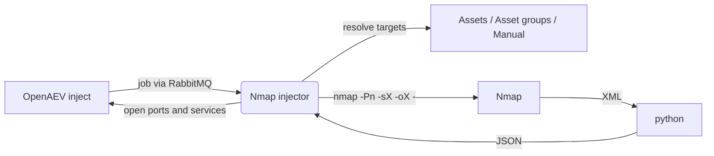

# OpenAEV Nmap Injector

The Nmap injector lets OpenAEV run network port scans as part of attack scenarios using
[Nmap](https://nmap.org/), the open-source network mapper. It exposes ready-to-use inject contracts (SYN, TCP Connect
and FIN scans), resolves the targets from your OpenAEV assets or from manual input, runs the scan, and reports the
discovered open ports and services back to OpenAEV as structured results.

## Table of Contents

- [OpenAEV Nmap Injector](#openaev-nmap-injector)
  - [Table of Contents](#table-of-contents)
  - [Introduction](#introduction)
  - [How it works](#how-it-works)
  - [Requirements](#requirements)
  - [Configuration variables](#configuration-variables)
    - [OpenAEV environment variables](#openaev-environment-variables)
    - [Base injector environment variables](#base-injector-environment-variables)
  - [Deployment](#deployment)
    - [Docker Deployment](#docker-deployment)
    - [Manual Deployment](#manual-deployment)
  - [Usage](#usage)
  - [Inject contracts](#inject-contracts)
  - [Target selection](#target-selection)
  - [Behavior](#behavior)
  - [Debugging](#debugging)
  - [Additional information](#additional-information)

## Introduction

OpenAEV (Breach and Attack Simulation) drives injectors to execute the technical actions of a scenario. The Nmap
injector registers a set of scan contracts with the OpenAEV platform; when an inject using one of these contracts is
played, OpenAEV dispatches a job to the injector, which performs the corresponding Nmap scan and returns the results.

## How it works

Injectors receive their jobs through the message broker (RabbitMQ) configured by the OpenAEV platform. The injector
fetches the broker connection details from OpenAEV at startup, so it only needs to be able to reach the OpenAEV URL and
the RabbitMQ host/port advertised by the platform.

## Requirements

- OpenAEV Platform >= 1.19.0, reachable from the injector (along with its RabbitMQ broker)
- For a manual (non-Docker) deployment:
  - Python >= 3.11 and [Poetry](https://python-poetry.org/) >= 2.1
  - The `nmap` binary available on the `PATH` (the Docker image already bundles them)

## Configuration variables

The injector is configured either through environment variables (recommended, read from `docker-compose.yml` / the
`.env` file for a Docker deployment) or through a `config.yml` file (for a manual deployment). Copy the provided
`.env.sample` / `config.yml.sample` and fill in the values flagged with `ChangeMe`.

### OpenAEV environment variables

| Parameter         | config.yml          | Docker environment variable | Mandatory | Description                                                                        |
|-------------------|---------------------|-----------------------------|-----------|------------------------------------------------------------------------------------|
| OpenAEV URL       | `openaev.url`       | `OPENAEV_URL`               | Yes       | The URL of the OpenAEV platform. Must be reachable from where the injector runs.   |
| OpenAEV Token     | `openaev.token`     | `OPENAEV_TOKEN`             | Yes       | The administrator token of the OpenAEV platform.                                   |
| OpenAEV Tenant ID | `openaev.tenant_id` | `OPENAEV_TENANT_ID`         | No        | Tenant identifier for multi-tenant deployments. When set, it must be a valid UUID. |

### Base injector environment variables

| Parameter     | config.yml           | Docker environment variable | Default | Mandatory | Description                                                     |
|---------------|----------------------|-----------------------------|---------|-----------|-----------------------------------------------------------------|
| Injector ID   | `injector.id`        | `INJECTOR_ID`               | /       | Yes       | A unique `UUIDv4` identifier for this injector instance.        |
| Injector Name | `injector.name`      | `INJECTOR_NAME`             | Nmap    | No        | The name of the injector as shown in OpenAEV.                   |
| Log Level     | `injector.log_level` | `INJECTOR_LOG_LEVEL`        | error   | No        | Verbosity of the logs. One of `debug`, `info`, `warn`, `error`. |

## Deployment

### Docker Deployment

This injector depends on the shared `injector_common` package, so the image must be built with a build context that
exposes it:

```shell
docker build --build-context injector_common=../injector_common . -t openaev/injector-nmap:latest
```

Create a `.env` file from `.env.sample` and fill in your values, then start the injector with the provided
`docker-compose.yml`:

```shell
docker compose up -d
```

> If OpenAEV runs on your host machine while the injector runs in a container, set `OPENAEV_URL` to
> `http://host.docker.internal:<port>` rather than `localhost`. On Linux, also add
> `extra_hosts: ["host.docker.internal:host-gateway"]` to the service, and make sure OpenAEV listens on `0.0.0.0`.

### Manual Deployment

Make sure `nmap` is installed and on your `PATH`, create a `config.yml` from `config.yml.sample`, then install
and run the injector:

```shell
poetry install
poetry run python -m nmap.openaev_nmap
```

> For local development against a checkout of [client-python](https://github.com/OpenAEV-Platform/client-python)
> (cloned next to this repository), use `poetry install --extras dev`.

## Usage

Once started, the injector registers its contracts with OpenAEV and waits for jobs. Add an Nmap inject to a scenario or
atomic testing, select the scan type and the targets, and play it: the results are attached to the inject once the scan
completes.

## Inject contracts

| Contract              | Scan type        | Command executed             |
|-----------------------|------------------|------------------------------|
| Nmap - SYN Scan       | TCP SYN scan     | `nmap -Pn -sS -oX - <targets>` |
| Nmap - TCP Connect Scan | TCP connect scan | `nmap -Pn -sT -oX - <targets>` |
| Nmap - FIN Scan       | TCP FIN scan     | `nmap -Pn -sF -oX - <targets>` |

`-Pn` skips host discovery (treat all hosts as online). Nmap output is produced as XML (`-oX -`) and converted to JSON before being parsed into open ports and services.

## Target selection

Targets are resolved through the shared selection logic of `injector_common`:

- Target selector: `assets`, `asset-groups` (default), or `manual`.
- Target property selector (for assets / asset groups): `automatic` (default), `seen_ip`, `local_ip` (first), or
  `hostname`.

| Target property   | Asset field used                            |
|-------------------|---------------------------------------------|
| Automatic         | Hostname for agentless assets, else first valid IP |
| Seen IP           | `asset_seen_ip`                             |
| Local IP (first)  | First valid entry in `asset_ips`            |
| Hostname          | `asset_hostname`                            |

For manual targets, provide hostnames or IP addresses as comma-separated values. Invalid, loopback and link-local
addresses are filtered out.

## Behavior



On each job the injector acknowledges reception, resolves the targets, builds and runs the Nmap command, uses Python to convert the XML to JSON, parses the open ports and services, and returns a structured result (linked to the scanned
asset when applicable) together with a success or error status.

## Debugging

Set `INJECTOR_LOG_LEVEL=debug` to log the resolved targets and the exact Nmap command line that is executed. For manual
deployments, the most common issue is a missing `nmap` binary on the `PATH`.

## Additional information

- Official Nmap documentation: [https://nmap.org/docs.html](https://nmap.org/docs.html)
- Scan option reference: `-Pn` (skip host discovery), `-sS` (SYN scan), `-sT` (TCP connect scan), `-sF` (FIN scan).
