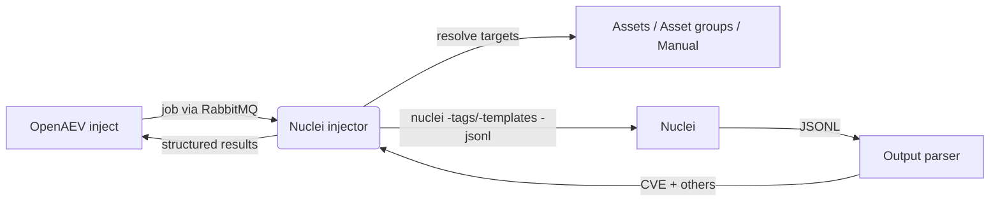

# OpenAEV Nuclei Injector

The Nuclei injector lets OpenAEV run template-based vulnerability scans as part of attack scenarios using
[Nuclei](https://projectdiscovery.io/nuclei) by ProjectDiscovery, the open-source vulnerability scanner. It exposes
ready-to-use, tag-based scan contracts (cloud, misconfiguration, exposure, CVE, panel, XSS, WordPress and full
templates) plus per-CVE contracts kept in sync with the official Nuclei CVE catalog. It resolves the targets from your
OpenAEV assets or from manual input, runs the scan, and reports the discovered CVEs and other findings back to OpenAEV
as structured results.

## Table of Contents

- [OpenAEV Nuclei Injector](#openaev-nuclei-injector)
  - [Table of Contents](#table-of-contents)
  - [Introduction](#introduction)
  - [How it works](#how-it-works)
  - [Requirements](#requirements)
  - [Configuration variables](#configuration-variables)
    - [OpenAEV environment variables](#openaev-environment-variables)
    - [Base injector environment variables](#base-injector-environment-variables)
    - [Nuclei injector environment variables](#nuclei-injector-environment-variables)
  - [Deployment](#deployment)
    - [Docker Deployment](#docker-deployment)
    - [Manual Deployment](#manual-deployment)
  - [Usage](#usage)
  - [Inject contracts](#inject-contracts)
  - [Target selection](#target-selection)
  - [Behavior](#behavior)
  - [Debugging](#debugging)
  - [Additional information](#additional-information)

## Introduction

OpenAEV (Breach and Attack Simulation) drives injectors to execute the technical actions of a scenario. The Nuclei
injector registers a set of scan contracts with the OpenAEV platform; when an inject using one of these contracts is
played, OpenAEV dispatches a job to the injector, which runs the corresponding Nuclei scan and returns the results. In
addition to the static contracts, the injector maintains a catalog of per-CVE contracts in the background so each
published Nuclei CVE template can be played individually.

## How it works

Injectors receive their jobs through the message broker (RabbitMQ) configured by the OpenAEV platform. The injector
fetches the broker connection details from OpenAEV at startup, so it only needs to be able to reach the OpenAEV URL and
the RabbitMQ host/port advertised by the platform.

## Requirements

- A running OpenAEV platform, reachable from the injector (along with its RabbitMQ broker)
- For a manual (non-Docker) deployment:
  - Python >= 3.11 and [Poetry](https://python-poetry.org/) >= 2.1
  - The `nuclei` binary available on the `PATH` (the Docker image bundles Nuclei `v3.8.0`)
  - Outbound network access to `raw.githubusercontent.com` and `github.com` so the injector can update the Nuclei
    templates and sync the per-CVE contracts

## Configuration variables

The injector is configured either through environment variables (recommended, read from `docker-compose.yml` / the
`.env` file for a Docker deployment) or through a `config.yml` file (for a manual deployment). Copy the provided
`.env.sample` / `config.yml.sample` and fill in the values flagged with `ChangeMe`.

### OpenAEV environment variables

| Parameter         | config.yml          | Docker environment variable | Mandatory | Description                                                                        |
|-------------------|---------------------|-----------------------------|-----------|------------------------------------------------------------------------------------|
| OpenAEV URL       | `openaev.url`       | `OPENAEV_URL`               | Yes       | The URL of the OpenAEV platform. Must be reachable from where the injector runs.   |
| OpenAEV Token     | `openaev.token`     | `OPENAEV_TOKEN`             | Yes       | The administrator token of the OpenAEV platform.                                   |
| OpenAEV Tenant ID | `openaev.tenant_id` | `OPENAEV_TENANT_ID`         | No        | Tenant identifier for multi-tenant deployments. When set, it must be a valid UUID. |

### Base injector environment variables

| Parameter     | config.yml           | Docker environment variable | Default | Mandatory | Description                                                     |
|---------------|----------------------|-----------------------------|---------|-----------|-----------------------------------------------------------------|
| Injector ID   | `injector.id`        | `INJECTOR_ID`               | /       | Yes       | A unique `UUIDv4` identifier for this injector instance.        |
| Injector Name | `injector.name`      | `INJECTOR_NAME`             | Nuclei  | No        | The name of the injector as shown in OpenAEV.                   |
| Log Level     | `injector.log_level` | `INJECTOR_LOG_LEVEL`        | error   | No        | Verbosity of the logs. One of `debug`, `info`, `warn`, `error`. |

### Nuclei injector environment variables

These tune how Nuclei runs. Each maps to a Nuclei command-line flag (shown in the description). `exclude_type` and
`exclude_severity` accept comma-separated values.

| Parameter                      | config.yml                              | Docker environment variable             | Default   | Mandatory | Description                                                                                                    |
|--------------------------------|-----------------------------------------|-----------------------------------------|-----------|-----------|----------------------------------------------------------------------------------------------------------------|
| Scan strategy                  | `nuclei.scan_strategy`                  | `NUCLEI_SCAN_STRATEGY`                  | host-spray| No        | Strategy used while scanning. One of `auto`, `host-spray`, `template-spray` (`-scan-strategy`).                |
| Templates parallelism          | `nuclei.templates_parallelism`          | `NUCLEI_TEMPLATES_PARALLELISM`          | 5         | No        | Maximum number of templates executed in parallel (`-concurrency`).                                             |
| Hosts parallelism per template | `nuclei.hosts_parallelism_per_template` | `NUCLEI_HOSTS_PARALLELISM_PER_TEMPLATE` | 5         | No        | Maximum number of hosts analyzed in parallel per template (`-bulk-size`).                                      |
| Max requests per second        | `nuclei.max_requests_per_second`        | `NUCLEI_MAX_REQUESTS_PER_SECOND`        | 50        | No        | Maximum number of requests sent per second (`-rate-limit`).                                                    |
| Timeout                        | `nuclei.timeout`                        | `NUCLEI_TIMEOUT`                        | 10        | No        | Time to wait in seconds before timeout (`-timeout`).                                                           |
| Retries                        | `nuclei.retries`                        | `NUCLEI_RETRIES`                        | 1         | No        | Number of times to retry a failed request (`-retries`).                                                        |
| Max host error                 | `nuclei.max_host_error`                 | `NUCLEI_MAX_HOST_ERROR`                 | 30        | No        | Max errors for a host before skipping it from the scan (`-max-host-error`).                                    |
| Response size read             | `nuclei.response_size_read`             | `NUCLEI_RESPONSE_SIZE_READ`             | 1048576   | No        | Max response size to read, in bytes (`-response-size-read`).                                                   |
| Response size save             | `nuclei.response_size_save`             | `NUCLEI_RESPONSE_SIZE_SAVE`             | 1048576   | No        | Max response size to save, in bytes (`-response-size-save`).                                                   |
| Exclude type                   | `nuclei.exclude_type`                   | `NUCLEI_EXCLUDE_TYPE`                   | headless  | No        | Protocol types to exclude: `dns`, `file`, `http`, `headless`, `tcp`, `workflow`, `ssl`, `websocket`, `whois`, `code`, `javascript` (`-exclude-type`). |
| Exclude severity               | `nuclei.exclude_severity`               | `NUCLEI_EXCLUDE_SEVERITY`               | /         | No        | Severities to exclude: `info`, `low`, `medium`, `high`, `critical`, `unknown` (`-exclude-severity`).           |

## Deployment

### Docker Deployment

This injector depends on the shared `injector_common` package, so the image must be built with a build context that
exposes it:

```shell
docker build --build-context injector_common=../injector_common . -t openaev/injector-nuclei:latest
```

Create a `.env` file from `.env.sample` and fill in your values, then start the injector with the provided
`docker-compose.yml`:

```shell
docker compose up -d
```

> If OpenAEV runs on your host machine while the injector runs in a container, set `OPENAEV_URL` to
> `http://host.docker.internal:<port>` rather than `localhost`. On Linux, also add
> `extra_hosts: ["host.docker.internal:host-gateway"]` to the service, and make sure OpenAEV listens on `0.0.0.0`.

### Manual Deployment

Make sure the `nuclei` binary is installed and on your `PATH` (the Docker image bundles `v3.8.0`), create a `config.yml`
from `config.yml.sample`, then install and run the injector:

```shell
poetry install
poetry run python -m nuclei.openaev_nuclei
```

> For local development against a checkout of [client-python](https://github.com/OpenAEV-Platform/client-python)
> (cloned next to this repository), use `poetry install --extras dev`.

## Usage

Once started, the injector registers its contracts with OpenAEV and waits for jobs. Add a Nuclei inject to a scenario or
atomic testing, select the scan type and the targets, and play it: the results are attached to the inject once the scan
completes. The injector also checks that the `nuclei` binary is available at startup and refuses to start if it is not.

## Inject contracts

Each contract runs `nuclei` against the resolved targets (fed on standard input) and writes JSONL output (`-jsonl`).
The static contracts select Nuclei templates by tag:

| Contract                    | Templates selected             | Nuclei flag              |
|-----------------------------|--------------------------------|--------------------------|
| Nuclei - Cloud Templates    | Cloud templates                | `-tags cloud`            |
| Nuclei - Misconfigurations  | Misconfiguration templates     | `-tags misconfiguration` |
| Nuclei - Exposures          | Exposure templates             | `-tags exposure`         |
| Nuclei - CVE Scan           | CVE templates                  | `-tags cve`              |
| Nuclei - Panel Scan         | Login/admin panel templates    | `-tags panel`            |
| Nuclei - XSS Scan           | Cross-site scripting templates | `-tags xss`              |
| Nuclei - Wordpress Scan     | WordPress templates            | `-tags wordpress`        |
| Nuclei - TEMPLATES Scan     | Full template set              | `-templates /`           |

> The `Nuclei - TEMPLATES Scan` contract runs the broadest, slowest scan: when no manual template is set it invokes
> `nuclei -templates /` to run Nuclei's full template set instead of a tag-filtered subset. Here `/` is the template
> path passed to Nuclei (not a special "all templates" keyword); scope the scan down with the manual template path
> field below whenever possible.

Every contract also exposes two optional free-text fields:

- `Manual template path (-t)` (`template`): run a specific template or template directory (`-templates <path>`).
- `Options` (`options`): extra raw Nuclei flags, appended to the command line.

In addition to the static contracts, a background scheduler maintains one contract per CVE. On each tick (every
`86400` seconds / 24h by default) it runs `nuclei -update-templates`, fetches the official Nuclei CVE catalog
(`cves.json` from the `projectdiscovery/nuclei-templates` repository), and creates, updates or deletes the matching
per-CVE contracts. Each per-CVE contract is labelled with the CVE/template ID and pre-fills the template path of that
CVE.

Common inject fields and outputs:

- Inputs: target selector (`Assets`, `Asset groups` (default), `Manual`), targeted assets / asset groups, the targeted
  asset property, manual targets (comma-separated) and expectations (predefined `Not vulnerable`, score 100).
- Outputs: `cve` (CVE findings, finding-compatible) and `others` (other text findings). The execution message
  summarizes how many CVEs and other vulnerabilities were found, or `Good News: Nothing Found !`.

## Target selection

Targets are resolved through the shared selection logic of `injector_common`:

- Target selector: `assets`, `asset-groups` (default), or `manual`.
- Target property selector (for assets / asset groups): `automatic` (default), `seen_ip`, `local_ip` (first), or
  `hostname`.

| Target property   | Asset field used                                   |
|-------------------|----------------------------------------------------|
| Automatic         | Hostname for agentless assets, else first valid IP |
| Seen IP           | `asset_seen_ip`                                    |
| Local IP (first)  | First valid entry in `asset_ips`                   |
| Hostname          | `asset_hostname`                                   |

For manual targets, provide hostnames or IP addresses as comma-separated values. Invalid, loopback, unspecified and
link-local addresses are filtered out.

## Behavior



On each job the injector acknowledges reception, resolves the targets, builds the `nuclei` command line from the
contract tag and the configured options, runs the scan with the targets on standard input, parses the JSONL output into
CVE findings and other results, and returns a structured result (linked to the scanned asset when applicable) together
with a success or error status. A separate background scheduler keeps the per-CVE contracts in sync with the Nuclei CVE
catalog.

## Debugging

Set `INJECTOR_LOG_LEVEL=debug` to log the resolved targets and the exact `nuclei` command line that is executed (logged
as `Executing nuclei with: ...`). For manual deployments, the most common issue is a missing `nuclei` binary on the
`PATH` (the injector checks `nuclei -version` at startup). If the per-CVE contracts are not appearing or updating, check
that the injector can reach `raw.githubusercontent.com` and review the maintenance logs.

## Additional information

- Official Nuclei documentation: [https://docs.projectdiscovery.io/tools/nuclei/overview](https://docs.projectdiscovery.io/tools/nuclei/overview)
- Nuclei flags reference: [https://docs.projectdiscovery.io/tools/nuclei/running](https://docs.projectdiscovery.io/tools/nuclei/running)
- Nuclei templates and CVE catalog: [https://github.com/projectdiscovery/nuclei-templates](https://github.com/projectdiscovery/nuclei-templates)
