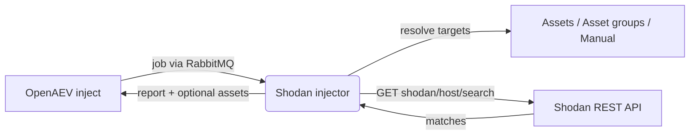

# OpenAEV Shodan Injector

The Shodan injector lets OpenAEV run OSINT discovery actions as part of attack scenarios using the
[Shodan](https://www.shodan.io/) REST API. It exposes ready-to-use inject contracts (cloud asset discovery, critical
ports / exposed admin interfaces, CVE enumeration and watchlists, domain and IP discovery, and a free-form custom query),
resolves the targets from your OpenAEV assets or from manual input, queries Shodan, and reports the matches back to
OpenAEV - optionally creating assets from the results.

## Table of Contents

- [OpenAEV Shodan Injector](#openaev-shodan-injector)
  - [Table of Contents](#table-of-contents)
  - [Introduction](#introduction)
  - [How it works](#how-it-works)
  - [Requirements](#requirements)
  - [Configuration variables](#configuration-variables)
    - [OpenAEV environment variables](#openaev-environment-variables)
    - [Base injector environment variables](#base-injector-environment-variables)
    - [Shodan injector environment variables](#shodan-injector-environment-variables)
  - [Deployment](#deployment)
    - [Docker Deployment](#docker-deployment)
    - [Manual Deployment](#manual-deployment)
  - [Usage](#usage)
  - [Inject contracts](#inject-contracts)
  - [Target selection](#target-selection)
  - [Behavior](#behavior)
  - [Debugging](#debugging)
  - [Additional information](#additional-information)

## Introduction

OpenAEV (Breach and Attack Simulation) drives injectors to execute the technical actions of a scenario. The Shodan
injector registers a set of discovery contracts with the OpenAEV platform; when an inject using one of these contracts is
played, OpenAEV dispatches a job to the injector, which builds the matching Shodan query, calls the Shodan REST API and
returns the results.

## How it works

Injectors receive their jobs through the message broker (RabbitMQ) configured by the OpenAEV platform. The injector
fetches the broker connection details from OpenAEV at startup, so it only needs to be able to reach the OpenAEV URL and
the RabbitMQ host/port advertised by the platform. At execution time, it also needs outbound access to the Shodan API.

## Requirements

- A running OpenAEV platform, reachable from the injector (along with its RabbitMQ broker).
- A valid Shodan API key (`SHODAN_API_KEY`) and outbound network access to `https://api.shodan.io`.
- No additional system binaries are required: the Shodan API is called with the Python `requests` library.
- The Docker image must be built with `--build-context injector_common=../injector_common`, because the injector depends
  on the shared `injector_common` package located one level above this directory.
- For a manual (non-Docker) deployment:
  - Python >= 3.11 and [Poetry](https://python-poetry.org/) >= 2.1.

## Configuration variables

The injector is configured either through environment variables (recommended, read from `docker-compose.yml` / the
`.env` file for a Docker deployment) or through a `config.yml` file (for a manual deployment). Copy the provided
`.env.sample` / `config.yml.sample` and fill in the values flagged with `ChangeMe`.

### OpenAEV environment variables

| Parameter         | config.yml          | Docker environment variable | Mandatory | Description                                                                        |
|-------------------|---------------------|-----------------------------|-----------|------------------------------------------------------------------------------------|
| OpenAEV URL       | `openaev.url`       | `OPENAEV_URL`               | Yes       | The URL of the OpenAEV platform. Must be reachable from where the injector runs.   |
| OpenAEV Token     | `openaev.token`     | `OPENAEV_TOKEN`             | Yes       | The administrator token of the OpenAEV platform.                                   |
| OpenAEV Tenant ID | `openaev.tenant_id` | `OPENAEV_TENANT_ID`         | No        | Tenant identifier for multi-tenant deployments. When set, it must be a valid UUID. |

### Base injector environment variables

| Parameter     | config.yml           | Docker environment variable | Default | Mandatory | Description                                                     |
|---------------|----------------------|-----------------------------|---------|-----------|-----------------------------------------------------------------|
| Injector ID   | `injector.id`        | `INJECTOR_ID`               | /       | Yes       | A unique `UUIDv4` identifier for this injector instance.        |
| Injector Name | `injector.name`      | `INJECTOR_NAME`             | Shodan  | No        | The name of the injector as shown in OpenAEV.                   |
| Log Level     | `injector.log_level` | `INJECTOR_LOG_LEVEL`        | error   | No        | Verbosity of the logs. One of `debug`, `info`, `warn`, `error`. |

### Shodan injector environment variables

| Parameter                        | config.yml                       | Docker environment variable        | Default                 | Mandatory | Description                                                                                          |
|----------------------------------|----------------------------------|------------------------------------|-------------------------|-----------|------------------------------------------------------------------------------------------------------|
| Shodan API Key                   | `shodan.api_key`                 | `SHODAN_API_KEY`                   | /                       | Yes       | API key used to authenticate against the Shodan REST API.                                            |
| Shodan Base URL                  | `shodan.base_url`                | `SHODAN_BASE_URL`                  | `https://api.shodan.io` | No        | Base URL of the Shodan API.                                                                          |
| API leaky bucket rate            | `shodan.api_leaky_bucket_rate`   | `SHODAN_API_LEAKY_BUCKET_RATE`     | `10`                    | No        | Bucket refill rate (tokens per second): how many calls are allowed per second when the bucket is not empty. |
| API leaky bucket capacity        | `shodan.api_leaky_bucket_capacity` | `SHODAN_API_LEAKY_BUCKET_CAPACITY` | `10`                  | No        | Maximum bucket capacity (tokens): the burst size allowed before requests are paced.                  |
| API retry                        | `shodan.api_retry`               | `SHODAN_API_RETRY`                 | `5`                     | No        | Maximum number of attempts (including the initial request) on API failure.                           |
| API backoff                      | `shodan.api_backoff`             | `SHODAN_API_BACKOFF`               | `PT30S`                 | No        | Maximum exponential backoff delay between retries (ISO 8601 duration, e.g. `PT30S`).                 |

## Deployment

### Docker Deployment

This injector depends on the shared `injector_common` package, so the image must be built with a build context that
exposes it:

```shell
docker build --build-context injector_common=../injector_common . -t openaev/injector-shodan:latest
```

Create a `.env` file from `.env.sample` and fill in your values (including `SHODAN_API_KEY`), then start the injector
with the provided `docker-compose.yml`:

```shell
docker compose up -d
```

> If OpenAEV runs on your host machine while the injector runs in a container, set `OPENAEV_URL` to
> `http://host.docker.internal:<port>` rather than `localhost`. On Linux, also add
> `extra_hosts: ["host.docker.internal:host-gateway"]` to the service, and make sure OpenAEV listens on `0.0.0.0`.

### Manual Deployment

Create a `config.yml` from `config.yml.sample` (set at least `shodan.api_key`), then install and run the injector:

```shell
poetry install
poetry run python -m shodan
```

> For local development against a checkout of [client-python](https://github.com/OpenAEV-Platform/client-python)
> (cloned next to this repository), use `poetry install --extras dev`.

## Usage

Once started, the injector registers its contracts with OpenAEV and waits for jobs. Add a Shodan inject to a scenario or
atomic testing, choose the contract, set the targets (assets, asset groups, or manual input) and any contract-specific
fields, optionally enable "Auto-Create assets", then play it. The injector runs one Shodan search per resolved target,
then makes a final call to retrieve your account quota/plan, and attaches a formatted report to the inject.

Every contract exposes a target selector, an optional "Auto-Create assets" checkbox and expectations. In manual mode you
fill the contract's own input fields:

| Contract                                    | Manual-mode fields (mandatory in bold)            | Notable defaults                                                                 |
|---------------------------------------------|---------------------------------------------------|----------------------------------------------------------------------------------|
| Cloud Provider Asset Discovery              | **Cloud Provider**, **Hostname**, Organization    | Cloud Provider default `Google, Microsoft, Amazon, Azure`                        |
| Critical Ports and Exposed Admin Interface  | **Port**, **Hostname**, Organization              | Port default `20,21,22,23,25,53,80,110,111,135,139,143,443,445,993,995,1723,3306,3389,5900,8080` |
| CVE Enumeration                             | **Hostname**, Organization                        | -                                                                                |
| CVE Specific Watchlist                      | **Vulnerability**, **Hostname**, Organization     | -                                                                                |
| Domain Discovery                            | **Hostname**, Organization                        | -                                                                                |
| IP Enumeration                              | **IP**                                            | -                                                                                |
| Custom Query                                | **Custom Query**                                  | Manual targets only                                                              |

When the Organization field is left empty, the organization is derived from each hostname; otherwise the value is applied
to all hostnames.

## Inject contracts

All contracts share the label "Shodan" and produce a `found_assets` output (populated only when "Auto-Create assets" is
enabled). Each contract issues `GET shodan/host/search` requests; the "Custom Query" contract sends your raw query
string, while the others build a Shodan filter expression from the contract fields.

| Contract                                    | Shodan query built                                            | Target mode               |
|---------------------------------------------|---------------------------------------------------------------|---------------------------|
| Shodan - Cloud Provider Asset Discovery     | `cloud.provider:<providers>` + `hostname` / `org`             | assets / asset-groups / manual |
| Shodan - Critical ports and exposed admin interface | `port:<ports>` + `hostname` / `org`                   | assets / asset-groups / manual |
| Shodan - CVE Enumeration                    | `has_vuln:true` + `hostname` / `org`                          | assets / asset-groups / manual |
| Shodan - CVE specific watchlist             | `vuln:<cve>` + `hostname` / `org`                             | assets / asset-groups / manual |
| Shodan - Domain discovery                   | `hostname:<host>,*.<host>` + `org`                            | assets / asset-groups / manual |
| Shodan - IP Enumeration                     | `ip:<address>`                                                | assets / asset-groups / manual |
| Shodan - Custom query                       | Raw `query=<your query>` passed straight to the search API    | manual only               |

For hostname-based contracts, each hostname is queried together with its wildcard (e.g. `hostname:filigran.io,*.filigran.io`).

## Target selection

Targets can come from OpenAEV assets or from manual input, selected per inject:

- Target selector: `assets`, `asset-groups` (default), or `manual` (the "Custom query" contract is restricted to
  `manual`).
- Target property selector (for assets / asset groups): `automatic` (default), `seen_ip`, `local_ip` (first), or
  `hostname`.

| Target property   | Asset field used                            |
|-------------------|---------------------------------------------|
| Automatic         | Hostnames and IPs collected from the assets |
| Seen IP           | `asset_seen_ip`                             |
| Local IP (first)  | First entry in `asset_ips`                  |
| Hostname          | `asset_hostname`                            |

The resolved hostnames or IP addresses are not scanned directly; they are used as the value of the Shodan filter for the
chosen contract (hostname-based contracts use the hostnames, IP Enumeration uses the IP addresses). Asset groups are
expanded with the shared `injector_common` pagination helper. In manual mode, the values come from the contract's own
fields instead (hostname, IP, vulnerability, custom query, etc.).

When "Auto-Create assets" is enabled, the injector extracts hostnames, IPs and platform information from the Shodan
responses, deduplicates them (by hostname, platform and architecture) and returns them as structured assets.

## Behavior



On each job the injector acknowledges reception, normalizes and validates the input data, resolves the targets, builds
and sends the Shodan search request(s) (rate-limited and retried with exponential backoff), optionally builds structured
assets from the matches, fetches the account quota, and returns a formatted report with a success or error status.

## Debugging

Set `INJECTOR_LOG_LEVEL=debug` (or `info`) for verbose logs covering normalization, target resolution and each API call.
Common issues:

- Missing or invalid `SHODAN_API_KEY`: the injector cannot authenticate against Shodan (API keys are stripped from
  logged URLs).
- `HTTP 429 Too Many Requests`: lower `SHODAN_API_LEAKY_BUCKET_RATE` / `SHODAN_API_LEAKY_BUCKET_CAPACITY` or raise
  `SHODAN_API_RETRY` / `SHODAN_API_BACKOFF`.
- The "CVE specific watchlist" contract relies on the `vuln` filter, which requires an eligible Shodan plan (academic,
  Small Business API subscribers and higher).

## Additional information

- Shodan website: [https://www.shodan.io/](https://www.shodan.io/)
- Shodan REST API documentation: [https://developer.shodan.io/api](https://developer.shodan.io/api)
- Shodan search filters: [https://www.shodan.io/search/filters](https://www.shodan.io/search/filters)
- Create a Shodan account / API key: [https://account.shodan.io/register](https://account.shodan.io/register)
