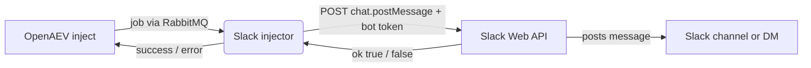

# OpenAEV Slack Injector

The Slack injector lets OpenAEV post messages and [Block Kit](https://api.slack.com/block-kit) layouts into a Slack
channel or a direct message as part of attack scenarios. It talks to the official
[Slack Web API](https://docs.slack.dev/apis/web-api/) (`chat.postMessage`) with a bot token - there is no incoming
webhook in the middle. It exposes a single, flexible inject contract that targets a channel or a user, renders the
content as Block Kit or as plain text, and reports whether Slack accepted the message.

## Table of Contents

- [OpenAEV Slack Injector](#openaev-slack-injector)
  - [Table of Contents](#table-of-contents)
  - [Introduction](#introduction)
  - [How it works](#how-it-works)
  - [Requirements](#requirements)
  - [Slack app setup](#slack-app-setup)
    - [1. Create the Slack app](#1-create-the-slack-app)
    - [2. Add the bot scope](#2-add-the-bot-scope)
    - [3. Install the app and copy the bot token](#3-install-the-app-and-copy-the-bot-token)
    - [4. Invite the bot to the channel](#4-invite-the-bot-to-the-channel)
  - [Configuration variables](#configuration-variables)
    - [OpenAEV environment variables](#openaev-environment-variables)
    - [Base injector environment variables](#base-injector-environment-variables)
    - [Slack environment variables](#slack-environment-variables)
  - [Deployment](#deployment)
    - [Docker Deployment](#docker-deployment)
    - [Manual Deployment](#manual-deployment)
  - [Usage](#usage)
    - [Finding the channel or user ID](#finding-the-channel-or-user-id)
  - [Inject contract](#inject-contract)
  - [Block Kit](#block-kit)
  - [Behavior](#behavior)
  - [Debugging](#debugging)
  - [Additional information](#additional-information)

## Introduction

OpenAEV (Breach and Attack Simulation) drives injectors to execute the technical actions of a scenario. The Slack
injector registers a single message contract with the OpenAEV platform; when an inject using this contract is played,
OpenAEV dispatches a job to the injector, which posts the message to Slack through the Slack Web API and reports the
result.

## How it works

Injectors receive their jobs through the message broker (RabbitMQ) configured by the OpenAEV platform. The injector
fetches the broker connection details from OpenAEV at startup, so it only needs to be able to reach the OpenAEV URL and
the RabbitMQ host/port advertised by the platform. To deliver a message, the injector also needs outbound HTTPS access to
`slack.com`.

For each job the injector builds a `chat.postMessage` request from the inject content (a Block Kit `blocks` array or a
plain text body, always with a `text` fallback for notifications), posts it with the bot token, and reports `SUCCESS`
when Slack replies with `ok: true`, otherwise `ERROR` with the Slack error code.

## Requirements

- A running OpenAEV platform, reachable from the injector (along with its RabbitMQ broker).
- A Slack workspace where you can create/install an app.
- A Slack bot token (`xoxb-...`) with the `chat:write` scope - see [Slack app setup](#slack-app-setup).
- Outbound HTTPS access from the injector to `slack.com`.
- For a manual (non-Docker) deployment: Python >= 3.11 and [Poetry](https://python-poetry.org/) >= 2.1.

## Slack app setup

### 1. Create the Slack app

1. Go to [https://api.slack.com/apps](https://api.slack.com/apps) and click **Create New App > From scratch**.
2. Give it a name (e.g. `OpenAEV`) and pick your workspace.

### 2. Add the bot scope

1. Open **OAuth & Permissions** in the left menu.
2. Under **Scopes > Bot Token Scopes**, add `chat:write`.
3. (Optional) Add `chat:write.public` so the bot can post to **public** channels without being invited first.

### 3. Install the app and copy the bot token

1. Still under **OAuth & Permissions**, click **Install to Workspace** and approve.
2. Copy the **Bot User OAuth Token** (starts with `xoxb-`). This is `SLACK_BOT_TOKEN`.

### 4. Invite the bot to the channel

For a private channel (or any channel if you did not add `chat:write.public`), the bot must be a member: open the
channel in Slack and run `/invite @YourApp`. For direct messages, use the recipient's Slack **user ID** as the channel
value.

## Configuration variables

The injector is configured either through environment variables (recommended, read from `docker-compose.yml` / the
`.env` file for a Docker deployment) or through a `config.yml` file (for a manual deployment). Copy the provided
`.env.sample` / `config.yml.sample` and fill in the values flagged with `ChangeMe`.

### OpenAEV environment variables

| Parameter     | config.yml      | Docker environment variable | Mandatory | Description                                                                      |
|---------------|-----------------|-----------------------------|-----------|----------------------------------------------------------------------------------|
| OpenAEV URL   | `openaev.url`   | `OPENAEV_URL`               | Yes       | The URL of the OpenAEV platform. Must be reachable from where the injector runs. |
| OpenAEV Token | `openaev.token` | `OPENAEV_TOKEN`             | Yes       | The administrator token of the OpenAEV platform.                                 |

### Base injector environment variables

| Parameter     | config.yml           | Docker environment variable | Default | Mandatory | Description                                                     |
|---------------|----------------------|-----------------------------|---------|-----------|-----------------------------------------------------------------|
| Injector ID   | `injector.id`        | `INJECTOR_ID`               | /       | Yes       | A unique `UUIDv4` identifier for this injector instance.        |
| Injector Name | `injector.name`      | `INJECTOR_NAME`             | Slack   | No        | The name of the injector as shown in OpenAEV.                   |
| Log Level     | `injector.log_level` | `INJECTOR_LOG_LEVEL`        | info    | No        | Verbosity of the logs. One of `debug`, `info`, `warn`, `error`. |

### Slack environment variables

| Parameter       | config.yml                      | Docker environment variable      | Default                 | Mandatory | Description                                            |
|-----------------|---------------------------------|----------------------------------|-------------------------|-----------|--------------------------------------------------------|
| Bot token       | `slack.bot_token`               | `SLACK_BOT_TOKEN`                | /                       | Yes       | Slack bot token (`xoxb-...`) with the `chat:write` scope. |
| Base URL        | `slack.base_url`                | `SLACK_BASE_URL`                 | `https://slack.com/api` | No        | Base URL of the Slack Web API.                          |
| Request timeout | `slack.request_timeout_seconds` | `SLACK_REQUEST_TIMEOUT_SECONDS`  | `30`                    | No        | HTTP timeout (seconds) for a single Slack request.      |

## Deployment

### Docker Deployment

This injector depends on the shared `injector_common` package, so the image must be built with a build context that
exposes it:

```shell
docker build --build-context injector_common=../injector_common . -t openaev/injector-slack:latest
```

Create a `.env` file from `.env.sample` and fill in your values, then start the injector with the provided
`docker-compose.yml`:

```shell
docker compose up -d
```

> If OpenAEV runs on your host machine while the injector runs in a container, set `OPENAEV_URL` to
> `http://host.docker.internal:<port>` rather than `localhost`. On Linux, also add
> `extra_hosts: ["host.docker.internal:host-gateway"]` to the service, and make sure OpenAEV listens on `0.0.0.0`.

### Manual Deployment

Create a `config.yml` from `config.yml.sample`, then install and run the injector:

```shell
poetry install
poetry run python -m slack_injector.openaev_slack
```

> For local development against a checkout of [client-python](https://github.com/OpenAEV-Platform/client-python)
> (cloned next to this repository), use `poetry install --extras dev`.

## Usage

Once started, the injector registers its contract with OpenAEV and waits for jobs. Add a Slack inject to a scenario or
atomic testing, set the channel or user, pick the message format and play it: the injector sends the message through the
Slack Web API and the inject is marked successful once Slack accepts it.

### Finding the channel or user ID

- **Channel**: use the channel ID (starts with `C`), which you can copy from **Channel details > About** (bottom), or
  simply use `#channel-name`. IDs are more reliable than names.
- **User (DM)**: use the user ID (starts with `U`), available in a user's profile under **More > Copy member ID**.

## Inject contract

| Contract            | Key fields                                                        | Action                                                     |
|---------------------|-------------------------------------------------------------------|-----------------------------------------------------------|
| Slack - Send message | Channel or user, Message format, Title, Message, Custom Block Kit JSON | `POST chat.postMessage` to the selected channel or user. |

Fields:

- **Channel or user** (`channel`): a channel ID (`C...`), a `#channel-name`, or a user ID (`U...`) for a DM. Mandatory.
- **Message format** (`content_type`): `blocks` (Block Kit, default) or `text` (plain text / mrkdwn).
- **Title** (`title`) and **Message** (`message`): mandatory; used as the header/section text or the plain message,
  and always as the plain-text fallback Slack shows in notifications and previews.
- **Custom Block Kit blocks JSON** (`blocks_json`): optional, only for the Block Kit format. When provided it is sent
  verbatim as the `blocks` array and replaces the auto-built layout (header + section). Title and message remain
  mandatory because they still provide the `text` notification fallback sent alongside the blocks.

The contract returns no structured outputs. The inject is marked `SUCCESS` when Slack replies with `ok: true`, and
`ERROR` otherwise (with the Slack error code, e.g. `channel_not_found`, `not_in_channel`, `invalid_auth`).

## Block Kit

[Block Kit](https://api.slack.com/block-kit) is Slack's UI framework for rich, structured messages. In `blocks` mode the
injector builds a simple layout (a `header` and a `section`) from the title and message. For full control, paste a
complete Block Kit `blocks` **array** into **Custom Block Kit blocks JSON** - for example:

```json
[
  { "type": "header", "text": { "type": "plain_text", "text": "Security drill" } },
  { "type": "section", "text": { "type": "mrkdwn", "text": "A simulated phishing message was just delivered." } },
  {
    "type": "actions",
    "elements": [
      { "type": "button", "text": { "type": "plain_text", "text": "Open runbook" }, "url": "https://example.com/runbook" }
    ]
  }
]
```

A `text` fallback is always sent alongside the blocks so notifications and previews render correctly. Keep messages under
Slack's limits (max 50 blocks, ~3000 characters per section text).

## Behavior



## Debugging

Set `INJECTOR_LOG_LEVEL=debug` for more verbose logs. Common Slack error codes:

- `invalid_auth` / `not_authed`: the bot token is missing, wrong or revoked - reinstall the app and update
  `SLACK_BOT_TOKEN`.
- `channel_not_found`: the channel/user id is wrong.
- `not_in_channel`: the bot is not a member of the (private) channel - invite it with `/invite @YourApp`, or add the
  `chat:write.public` scope for public channels.
- `invalid_blocks`: the custom Block Kit JSON is not a valid `blocks` array.

## Additional information

- Slack `chat.postMessage`: [https://docs.slack.dev/reference/methods/chat.postmessage](https://docs.slack.dev/reference/methods/chat.postmessage)
- `chat:write` scope: [https://docs.slack.dev/reference/scopes/chat.write](https://docs.slack.dev/reference/scopes/chat.write)
- Block Kit: [https://api.slack.com/block-kit](https://api.slack.com/block-kit)
- Block Kit Builder (design + export JSON): [https://app.slack.com/block-kit-builder](https://app.slack.com/block-kit-builder)
