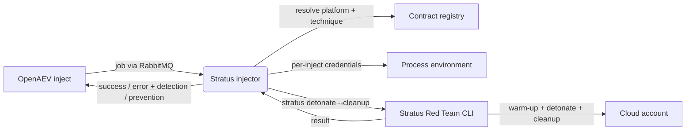

# OpenAEV Stratus Red Team Injector

The Stratus Red Team injector lets OpenAEV emulate granular cloud and container adversary techniques as part of attack
scenarios using [Stratus Red Team](https://stratus-red-team.cloud/) by DataDog. It exposes **one inject contract per
Stratus technique** (across AWS, Azure, Entra ID, GCP, Kubernetes and Amazon EKS), plus a per-platform "custom
technique" contract, detonates the technique with automatic cleanup so no live infrastructure is left behind, and
reports the result back to OpenAEV. Each technique contract is tagged with its MITRE ATT&CK technique ids where Stratus
declares them, and every inject raises detection and prevention expectations that runtime detection collectors can
later validate.

## Table of Contents

- [OpenAEV Stratus Red Team Injector](#openaev-stratus-red-team-injector)
  - [Table of Contents](#table-of-contents)
  - [Introduction](#introduction)
  - [How it works](#how-it-works)
  - [Requirements](#requirements)
  - [Configuration variables](#configuration-variables)
    - [OpenAEV environment variables](#openaev-environment-variables)
    - [Base injector environment variables](#base-injector-environment-variables)
  - [Deployment](#deployment)
    - [Docker Deployment](#docker-deployment)
    - [Manual Deployment](#manual-deployment)
  - [Usage](#usage)
  - [Inject contracts](#inject-contracts)
  - [Supported platforms](#supported-platforms)
  - [Target selection](#target-selection)
  - [Behavior](#behavior)
  - [Debugging](#debugging)
  - [Additional information](#additional-information)

## Introduction

OpenAEV (Breach and Attack Simulation) drives injectors to execute the technical actions of a scenario. The Stratus Red
Team injector registers a catalog of cloud attack techniques with the OpenAEV platform; when an inject using one of
these contracts is played, OpenAEV dispatches a job to the injector, which detonates the matching Stratus technique
against the cloud account behind the credentials provided in the inject, and returns the result. Attack scenarios are
therefore organized by capability - each specific TTP is a directly selectable inject rather than being split across one
injector per cloud.

## How it works

Injectors receive their jobs through the message broker (RabbitMQ) configured by the OpenAEV platform. The injector
fetches the broker connection details from OpenAEV at startup, so it only needs to be able to reach the OpenAEV URL and
the RabbitMQ host/port advertised by the platform. To detonate a technique, the injector runs the bundled `stratus`
binary, which provisions the technique's prerequisites (via Terraform) in the target cloud, detonates the attack and
then cleans up - so it needs outbound access to the target cloud provider's APIs.

## Requirements

- A running OpenAEV platform, reachable from the injector (along with its RabbitMQ broker).
- Cloud credentials for the platform you want to test - supplied per inject, not on the injector (see
  [Target selection](#target-selection)).
- The `stratus` binary must be available on the `PATH`. The Docker image downloads and verifies a pinned Stratus release
  (`v2.24.0` at the time of writing, checksum-verified during the build).
- The Docker image must be built with `--build-context injector_common=../injector_common`, because the injector depends
  on the shared `injector_common` package located one level above this directory.
- For a manual (non-Docker) deployment:
  - Python >= 3.11 and [Poetry](https://python-poetry.org/) >= 2.1.
  - The `stratus` binary installed and on the `PATH` (see the
    [Stratus Red Team installation guide](https://stratus-red-team.cloud/getting-started/)).

## Configuration variables

The injector is configured either through environment variables (recommended, read from `docker-compose.yml` / the
`.env` file for a Docker deployment) or through a `config.yml` file (for a manual deployment). Copy the provided
`.env.sample` / `config.yml.sample` and fill in the values flagged with `ChangeMe`.

Cloud credentials are not part of the injector configuration: they are supplied per inject (see
[Target selection](#target-selection)).

### OpenAEV environment variables

| Parameter         | config.yml          | Docker environment variable | Mandatory | Description                                                                        |
|-------------------|---------------------|-----------------------------|-----------|------------------------------------------------------------------------------------|
| OpenAEV URL       | `openaev.url`       | `OPENAEV_URL`               | Yes       | The URL of the OpenAEV platform. Must be reachable from where the injector runs.   |
| OpenAEV Token     | `openaev.token`     | `OPENAEV_TOKEN`             | Yes       | The administrator token of the OpenAEV platform.                                   |
| OpenAEV Tenant ID | `openaev.tenant_id` | `OPENAEV_TENANT_ID`         | No        | Tenant identifier for multi-tenant deployments. When set, it must be a valid UUID. |

### Base injector environment variables

| Parameter     | config.yml           | Docker environment variable | Default          | Mandatory | Description                                                     |
|---------------|----------------------|-----------------------------|------------------|-----------|-----------------------------------------------------------------|
| Injector ID   | `injector.id`        | `INJECTOR_ID`               | /                | Yes       | A unique `UUIDv4` identifier for this injector instance.        |
| Injector Name | `injector.name`      | `INJECTOR_NAME`             | Stratus Red Team | No        | The name of the injector as shown in OpenAEV.                   |
| Log Level     | `injector.log_level` | `INJECTOR_LOG_LEVEL`        | error            | No        | Verbosity of the logs. One of `debug`, `info`, `warn`, `error`. |

## Deployment

### Docker Deployment

This injector depends on the shared `injector_common` package, so the image must be built with a build context that
exposes it:

```shell
docker build --build-context injector_common=../injector_common . -t openaev/injector-stratus:latest
```

Create a `.env` file from `.env.sample` and fill in your values, then start the injector with the provided
`docker-compose.yml`:

```shell
docker compose up -d
```

> The Docker image already bundles the pinned `stratus` binary, so no further installation is needed inside the
> container.

> If OpenAEV runs on your host machine while the injector runs in a container, set `OPENAEV_URL` to
> `http://host.docker.internal:<port>` rather than `localhost`. On Linux, also add
> `extra_hosts: ["host.docker.internal:host-gateway"]` to the service, and make sure OpenAEV listens on `0.0.0.0`.

### Manual Deployment

Make sure the `stratus` binary is installed and on your `PATH`, create a `config.yml` from `config.yml.sample`, then
install and run the injector:

```shell
poetry install
poetry run python -m stratus.openaev_stratus
```

> For local development against a checkout of [client-python](https://github.com/OpenAEV-Platform/client-python)
> (cloned next to this repository), use `poetry install --extras dev`.

## Usage

Once started, the injector registers its contracts with OpenAEV and waits for jobs. Add a Stratus inject to a scenario
or atomic testing, pick the technique contract for the platform you want to test (or the platform's "Detonate a custom
Stratus technique" contract), fill in the platform credentials, then play it: the detonation result is attached to the
inject once it completes.

## Inject contracts

The injector exposes two families of contracts, all under the `Stratus Red Team` label and the `CLOUD` security domain.
Every contract carries its platform's credential fields (see [Supported platforms](#supported-platforms)) and
predefined detection / prevention expectations (score 100 each).

- **One contract per Stratus technique** (99 in the pinned release). The technique is fixed by the contract - the
  operator only provides the platform credentials - and the contract is tagged with the technique's MITRE ATT&CK
  technique ids where Stratus declares them. The contract label is `<Platform> - <Technique name>`.
- **One "Detonate a custom Stratus technique" contract per platform** (6 total). It adds a free-form
  `Stratus technique id` field (e.g. `aws.persistence.iam-backdoor-user`) so any technique in the pinned Stratus release
  can be run even before a dedicated per-technique contract exists.

The technique catalog in `stratus/contracts/techniques.py` is auto-generated from the Stratus Red Team source
(`internal/attacktechniques`); regenerate it when the pinned Stratus release changes. Each contract returns the
detonated `technique` id as a structured output.

## Supported platforms

Each technique belongs to one platform, which determines the credential fields shown on the contract. Credentials are
provided per inject; secrets that Stratus reads from disk (the GCP service account key, the kubeconfig) are written to a
temporary file only for the detonation, restricted to the owner (`0600`), and removed afterwards (including on the
failure path). Credentials are never persisted in `config.yml` / `.env` and never logged.

| Platform              | Credential fields                                                                            |
|-----------------------|----------------------------------------------------------------------------------------------|
| AWS                   | Access key ID, secret access key, optional session token, region (default `us-east-1`)       |
| Azure                 | Tenant ID, subscription ID, service principal client ID, client secret                       |
| Entra ID              | Tenant ID, application (client) ID, client secret, optional subscription ID                  |
| Google Cloud Platform | Project ID, service account key (JSON, materialized to a temp file for the run)              |
| Kubernetes            | Kubeconfig (YAML, materialized to a temp file for the run)                                    |
| Amazon EKS            | AWS access key ID, secret access key, optional session token, region                         |

## Target selection

This injector does not target OpenAEV assets. The "target" of every inject is the cloud account reached through the
credentials carried by the inject itself. The injector builds the Stratus process environment from those credentials
(direct environment variables, or a temp file for file-based secrets) for the duration of the detonation only.

As a result, there is no asset / asset-group / manual selector and no target-property mapping. The blast radius of each
inject is whatever the supplied credentials are entitled to do on the target platform.

## Behavior



On each job the injector acknowledges reception, resolves the platform and technique from the contract id (or from the
inject content for a custom contract), builds the Stratus process environment from the per-inject credentials, and
detonates the technique with `--cleanup` (a 15-minute timeout covers the Terraform warm-up). It then reports
`SUCCESS` / `ERROR` to the platform; the detection and prevention expectations are scored by the relevant runtime
detection collectors. Materialized secret files are always removed afterwards, including on the failure path.

## Debugging

Set `INJECTOR_LOG_LEVEL=debug` (or `info`) to log the resolved technique and the `stratus` command line being executed.
Common issues:

- `stratus binary not found in the injector image`: for manual deployments, make sure `stratus` is installed and on the
  `PATH`.
- `No Stratus technique id provided` / `Unsupported contract ...`: for a custom contract, provide a valid technique id;
  otherwise the stored inject references a contract this injector version does not know.
- Authentication or permission errors in the detonation output: verify the platform credentials and that the identity is
  entitled to provision and detonate the technique's prerequisites.
- A run that times out after 15 minutes returns a timeout error - typically a slow or blocked Terraform warm-up.

## Additional information

- Stratus Red Team website: [https://stratus-red-team.cloud/](https://stratus-red-team.cloud/)
- Stratus Red Team source: [https://github.com/DataDog/stratus-red-team](https://github.com/DataDog/stratus-red-team)
- Attack technique catalog: [https://stratus-red-team.cloud/attack-techniques/list/](https://stratus-red-team.cloud/attack-techniques/list/)
- MITRE ATT&CK: [https://attack.mitre.org/](https://attack.mitre.org/)
- Techniques detonate real (though benign) actions against real cloud accounts; only run them against environments where
  that is acceptable.
