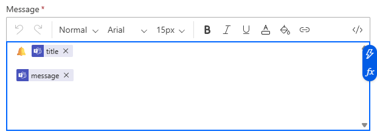

# OpenAEV Microsoft Teams Injector

The **OpenAEV Teams Injector** allows OpenAEV to send notifications to Microsoft Teams channels through HTTP-based
integrations (typically via Power Automate).

## Table of Contents

* [OpenAEV Teams Injector](#openaev-microsoft-teams-injector)

    * [Prerequisites](#prerequisites)
    * [Configuration](#configuration)

        * [OpenAEV Environment Variables](#openaev-environment-variables)
        * [Injector Environment Variables](#injector-environment-variables)
    * [Deployment](#deployment)

        * [Docker Deployment](#docker-deployment)
        * [Manual Deployment](#manual-deployment)
    * [Development](#development)
    * [Behavior](#behavior)

        * [Power Automate Workflow Requirements](#power-automate-workflow-requirements)
        * [Use Cases](#use-cases)

## Prerequisites

This injector communicates with the OpenAEV platform through **RabbitMQ**, using the configuration provided by OpenAEV.

To function properly, the injector **must be able to reach the RabbitMQ service** (hostname and port) defined in the
OpenAEV configuration.

## Configuration

Configuration values can be provided either:

* via `docker-compose.yml` (Docker deployment), or
* via `config.yml` (manual deployment).

### OpenAEV Environment Variables

The following parameters are required to connect the injector to the OpenAEV platform:

| Parameter     | `config.yml` | Docker Variable | Mandatory | Description                                         |
|---------------|--------------|-----------------|-----------|-----------------------------------------------------|
| OpenAEV URL   | `url`        | `OPENAEV_URL`   | Yes       | Base URL of the OpenAEV platform.                   |
| OpenAEV Token | `token`      | `OPENAEV_TOKEN` | Yes       | Admin API token configured in the OpenAEV platform. |

### Injector Environment Variables

The following parameters control the injector runtime behavior:

| Parameter     | `config.yml` | Docker Variable      | Default | Mandatory | Description                                             |
|---------------|--------------|----------------------|---------|-----------|---------------------------------------------------------|
| Injector ID   | `id`         | `INJECTOR_ID`        | —       | Yes       | Unique `UUIDv4` identifying this injector instance.     |
| Injector Name | `name`       | `INJECTOR_NAME`      | —       | Yes       | Human-readable name of the injector.                    |
| Log Level     | `log_level`  | `INJECTOR_LOG_LEVEL` | `info`  | Yes       | Logging verbosity: `debug`, `info`, `warn`, or `error`. |

## Deployment

### Docker Deployment

Build the Docker image using the provided `Dockerfile`:

```shell
docker build --build-context injector_common=../injector_common . -t openaev/injector-teams:latest
```
```shell
podman build --build-context injector_common=../injector_common . -t openaev/injector-teams:latest
```

Then configure the environment variables in `docker-compose.yml` and start the injector:

```shell
docker compose up -d
```

```shell
podman compose up -d
```

### Manual Deployment

1. Create a `config.yml` file based on `config.yml.sample`
2. Adjust the configuration values to match your environment

#### Requirements

* Python package manager **Poetry** (version 2.1 or later)
  👉 [https://python-poetry.org/](https://python-poetry.org/)

#### Installation

**Production environment**

```shell
poetry install
```

**Development environment**

For development, you should first clone the `pyoaev` repository following the instructions provided in the OpenAEV
documentation.

Install development dependencies

```shell
poetry install --extras dev
```

## Development

This project follows strict code formatting rules to ensure consistency and readability across the OpenAEV ecosystem.

Before submitting any **Pull Request**, contributors **must** format the codebase using **isort** and **black**.

### Code Formatting

The following tools are required (already included in the development dependencies):

* **isort** – import sorting
* **black** – code formatter

Run them from the project root:

```shell
poetry run isort --profile black .
poetry run black .
```

Both commands must complete **without errors or changes** before opening a PR.

> ⚠️ Pull Requests that do not respect formatting rules may be rejected or require additional review cycles.

#### Run the Injector

```shell
poetry run python -m teams.openaev_teams
```

## Behavior

This injector introduces **Microsoft Teams-specific inject contracts** in OpenAEV.

Each inject results in:

* an HTTP `POST` request,
* a JSON payload,
* targeting a **Power Automate HTTP trigger**, which then posts a message into a Microsoft Teams channel.

The injector reports execution status and metadata back to OpenAEV after completion.

## Power Automate Workflow Requirements

⚠️ **This injector only works with a specific type of Power Automate workflow.**

The injector **does not send messages directly to Microsoft Teams**.
It relies on **Power Automate** to expose an HTTP endpoint and forward messages to Teams.

### Supported Workflow Type

Only **Cloud flows** using the following trigger are supported:

> **When an HTTP request is received**

This trigger:

* Exposes an HTTP `POST` endpoint
* Accepts a JSON payload sent by the injector
* Allows posting messages to Teams using built-in actions

Other workflow types (scheduled flows, Teams-triggered flows, etc.) **are not compatible**.

### Minimal Workflow Structure

The Power Automate flow must follow this structure:

1. **Trigger**

    * *When an HTTP request is received*

2. **Optional**

    * *Initialize variable* (used to store or manipulate the request body)

3. **Action**

    * *Post a message in a chat or channel*
    * Posted as **Flow bot**
    * Targeting a **Team** and **Channel**
    * Message content mapped from the HTTP payload

### Expected Payload

The injector sends a JSON payload containing at least:

* `title` – Message title (e.g. alert name, exercise start)
* `message` – Main message content

These fields must be explicitly mapped in the **Post a message** action.

### Important Notes

* The HTTP endpoint URL generated by Power Automate **must be reachable** by the injector
* Authentication relies solely on the webhook URL
* Message formatting (emojis, layout, icons) is handled **inside Power Automate**
* The flow must be **saved and published** after any change

## Use Cases

### Supported Power Automate Workflow Example

Work with this kind of Power Automate workflow:


### Message Body Mapping Example

Example of message body configuration in the **Post a message in a chat or channel** step:

