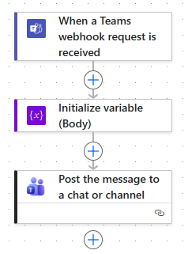
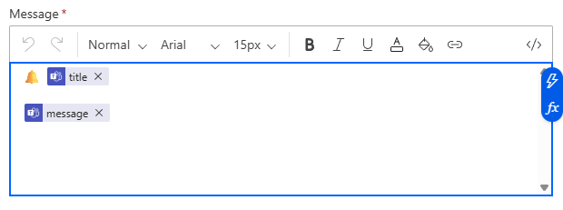
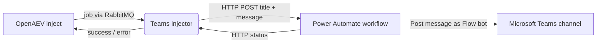

# OpenAEV Microsoft Teams Injector

The Microsoft Teams injector lets OpenAEV post a message to a Microsoft Teams channel as part of attack scenarios. It
does not call the Microsoft Teams APIs directly: instead it sends an HTTP POST to a Power Automate
("When an HTTP request is received") workflow, which posts the message into the channel on your behalf. It exposes a
single inject contract that takes the workflow URL, a title and a message, and reports whether the notification was
delivered.

## Table of Contents

- [OpenAEV Microsoft Teams Injector](#openaev-microsoft-teams-injector)
  - [Table of Contents](#table-of-contents)
  - [Introduction](#introduction)
  - [How it works](#how-it-works)
  - [Requirements](#requirements)
  - [Configuration variables](#configuration-variables)
    - [OpenAEV environment variables](#openaev-environment-variables)
    - [Base injector environment variables](#base-injector-environment-variables)
  - [Deployment](#deployment)
    - [Docker Deployment](#docker-deployment)
    - [Manual Deployment](#manual-deployment)
  - [Usage](#usage)
    - [Set up the Power Automate workflow](#set-up-the-power-automate-workflow)
  - [Inject contracts](#inject-contracts)
  - [Behavior](#behavior)
  - [Debugging](#debugging)
  - [Additional information](#additional-information)

## Introduction

OpenAEV (Breach and Attack Simulation) drives injectors to execute the technical actions of a scenario. The Microsoft
Teams injector registers a single message contract with the OpenAEV platform; when an inject using this contract is
played, OpenAEV dispatches a job to the injector, which posts `{"title": ..., "message": ...}` to the Power Automate
workflow URL provided in the inject. The workflow is then responsible for posting the message into the target Teams
chat or channel.

## How it works

Injectors receive their jobs through the message broker (RabbitMQ) configured by the OpenAEV platform. The injector
fetches the broker connection details from OpenAEV at startup, so it only needs to be able to reach the OpenAEV URL and
the RabbitMQ host/port advertised by the platform. To deliver a message, the injector also needs outbound HTTP access to
the Power Automate workflow URL.

## Requirements

- A running OpenAEV platform, reachable from the injector (along with its RabbitMQ broker)
- A Microsoft Teams channel and a Power Automate workflow exposing an HTTP trigger (see
  [Set up the Power Automate workflow](#set-up-the-power-automate-workflow))
- No additional system binaries are required
- For a manual (non-Docker) deployment:
  - Python >= 3.11 and [Poetry](https://python-poetry.org/) >= 2.1

## Configuration variables

The injector is configured either through environment variables (recommended, read from `docker-compose.yml` / the
`.env` file for a Docker deployment) or through a `config.yml` file (for a manual deployment). Copy the provided
`.env.sample` / `config.yml.sample` and fill in the values flagged with `ChangeMe`.

### OpenAEV environment variables

| Parameter     | config.yml      | Docker environment variable | Mandatory | Description                                                                      |
|---------------|-----------------|-----------------------------|-----------|----------------------------------------------------------------------------------|
| OpenAEV URL   | `openaev.url`   | `OPENAEV_URL`               | Yes       | The URL of the OpenAEV platform. Must be reachable from where the injector runs. |
| OpenAEV Token | `openaev.token` | `OPENAEV_TOKEN`             | Yes       | The administrator token of the OpenAEV platform.                                 |

### Base injector environment variables

| Parameter     | config.yml           | Docker environment variable | Default | Mandatory | Description                                                     |
|---------------|----------------------|-----------------------------|---------|-----------|-----------------------------------------------------------------|
| Injector ID   | `injector.id`        | `INJECTOR_ID`               | /       | Yes       | A unique `UUIDv4` identifier for this injector instance.        |
| Injector Name | `injector.name`      | `INJECTOR_NAME`             | Teams   | No        | The name of the injector as shown in OpenAEV.                   |
| Log Level     | `injector.log_level` | `INJECTOR_LOG_LEVEL`        | info    | No        | Verbosity of the logs. One of `debug`, `info`, `warn`, `error`. |

## Deployment

### Docker Deployment

This injector depends on the shared `injector_common` package, so the image must be built with a build context that
exposes it:

```shell
docker build --build-context injector_common=../injector_common . -t openaev/injector-teams:latest
```

Create a `.env` file from `.env.sample` and fill in your values, then start the injector with the provided
`docker-compose.yml`:

```shell
docker compose up -d
```

> If OpenAEV runs on your host machine while the injector runs in a container, set `OPENAEV_URL` to
> `http://host.docker.internal:<port>` rather than `localhost`. On Linux, also add
> `extra_hosts: ["host.docker.internal:host-gateway"]` to the service, and make sure OpenAEV listens on `0.0.0.0`.

### Manual Deployment

Create a `config.yml` from `config.yml.sample`, then install and run the injector:

```shell
poetry install
poetry run python -m teams.openaev_teams
```

> For local development against a checkout of [client-python](https://github.com/OpenAEV-Platform/client-python)
> (cloned next to this repository), use `poetry install --extras dev`.

## Usage

Once started, the injector registers its contract with OpenAEV and waits for jobs. Add a Teams inject to a scenario or
atomic testing, paste the Power Automate URL, set the title and message, and play it: the injector posts the message to
the workflow and the inject is marked successful once the workflow returns an HTTP 2xx response.

### Set up the Power Automate workflow

The injector posts a JSON body to a Power Automate workflow rather than to Microsoft Teams directly. Create the workflow
once, then reuse its URL in your injects:

1. In [Power Automate](https://make.powerautomate.com/), create a new cloud flow with the trigger
   **When an HTTP request is received**.
2. Provide a request body JSON schema with two string properties, `title` and `message` (this is exactly what the
   injector sends).
3. Add the Microsoft Teams action **Post message in a chat or channel**, posting as **Flow bot** to the target team and
   channel. Map the message content to the `title` and `message` values coming from the trigger.
4. Save the flow. Power Automate generates an **HTTP POST URL** - copy it and paste it into the inject's
   `Power Automate URL` field.





## Inject contracts

| Contract                | Fields                                          | Action                                                       |
|-------------------------|-------------------------------------------------|--------------------------------------------------------------|
| Teams - Channel message | Power Automate URL (`uri`), Title, Message      | HTTP POST `{"title": ..., "message": ...}` to the Power Automate URL |

All three fields are mandatory:

- `Power Automate URL` (`uri`): the HTTP trigger URL of the Power Automate workflow.
- `Title`: the message title sent in the JSON body.
- `Message`: the message body (multi-line text area) sent in the JSON body.

The contract returns no structured outputs. The inject is marked `SUCCESS` when the workflow replies with an HTTP 2xx
status, and `ERROR` otherwise (including on a request timeout, 5 seconds by default).

## Behavior


```mermaid
flowchart LR
    O[OpenAEV inject] -->|job via RabbitMQ| I(Teams injector)
    I -->|HTTP POST title + message| W[Power Automate workflow]
    W -->|Post message as Flow bot| C[Microsoft Teams channel]
    W -->|HTTP status| I
    I -->|success / error| O
```

On each job the injector acknowledges reception, validates that the contract is the Teams message contract, builds the
`{"title": ..., "message": ...}` payload from the inject content, and POSTs it to the Power Automate URL. It then reports a
success or error status back to OpenAEV based on the HTTP response.

## Debugging

Set `INJECTOR_LOG_LEVEL=debug` for more verbose logs. The most common issues are an incorrect or expired Power Automate
URL, or the injector being unable to reach it (network/proxy restrictions): both surface as an `ERROR` execution status
with the HTTP status code or the request error in the execution message.

## Additional information

- Power Automate - the "When an HTTP request is received" trigger:
  [https://learn.microsoft.com/training/modules/http-connectors/4-http-request](https://learn.microsoft.com/training/modules/http-connectors/4-http-request)
- Microsoft Teams - Power Automate flows:
  [https://support.microsoft.com/office/use-power-automate-in-microsoft-teams-c4ad99e5-6c9a-4d44-8a35-c8d2c4b7af8b](https://support.microsoft.com/office/use-power-automate-in-microsoft-teams-c4ad99e5-6c9a-4d44-8a35-c8d2c4b7af8b)
