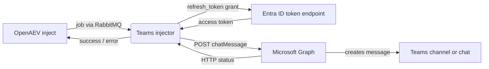

# OpenAEV Microsoft Teams Injector

The Microsoft Teams injector lets OpenAEV post messages and Adaptive Cards into Microsoft Teams channels and chats as
part of attack scenarios. It talks to the real [Microsoft Graph API](https://learn.microsoft.com/graph/overview) - there
is no Power Automate workflow and no incoming webhook in the middle. It exposes a single, flexible inject contract that
targets a team channel or a chat, renders the content as an Adaptive Card or as plain text, and reports whether Graph
accepted the message.

## Table of Contents

- [OpenAEV Microsoft Teams Injector](#openaev-microsoft-teams-injector)
  - [Table of Contents](#table-of-contents)
  - [Introduction](#introduction)
  - [How it works](#how-it-works)
  - [Authentication model (read this first)](#authentication-model-read-this-first)
  - [Requirements](#requirements)
  - [Microsoft Entra ID setup](#microsoft-entra-id-setup)
    - [1. Register the application](#1-register-the-application)
    - [2. Add the Graph delegated permissions](#2-add-the-graph-delegated-permissions)
    - [3. Create a client secret](#3-create-a-client-secret)
    - [4. Mint the long-lived refresh token (one-time consent)](#4-mint-the-long-lived-refresh-token-one-time-consent)
  - [Configuration variables](#configuration-variables)
    - [OpenAEV environment variables](#openaev-environment-variables)
    - [Base injector environment variables](#base-injector-environment-variables)
    - [Microsoft Graph environment variables](#microsoft-graph-environment-variables)
  - [Deployment](#deployment)
    - [Docker Deployment](#docker-deployment)
    - [Manual Deployment](#manual-deployment)
  - [Usage](#usage)
    - [Finding the team, channel and chat IDs](#finding-the-team-channel-and-chat-ids)
  - [Inject contract](#inject-contract)
  - [Adaptive Cards](#adaptive-cards)
  - [Behavior](#behavior)
  - [Debugging](#debugging)
  - [Additional information](#additional-information)

## Introduction

OpenAEV (Breach and Attack Simulation) drives injectors to execute the technical actions of a scenario. The Microsoft
Teams injector registers a single message contract with the OpenAEV platform; when an inject using this contract is
played, OpenAEV dispatches a job to the injector, which posts the message to Microsoft Teams through the Microsoft Graph
API and reports the result.

## How it works

Injectors receive their jobs through the message broker (RabbitMQ) configured by the OpenAEV platform. The injector
fetches the broker connection details from OpenAEV at startup, so it only needs to be able to reach the OpenAEV URL and
the RabbitMQ host/port advertised by the platform. To deliver a message, the injector also needs outbound HTTPS access to
`login.microsoftonline.com` (to acquire access tokens) and to `graph.microsoft.com` (to send the message).

For each job the injector:

1. Acquires a Microsoft Graph access token (see [Authentication model](#authentication-model-read-this-first)).
2. Builds the Graph `chatMessage` body from the inject content (an Adaptive Card attachment, or an HTML body).
3. Calls `POST /teams/{team-id}/channels/{channel-id}/messages` (channel) or `POST /chats/{chat-id}/messages` (chat).
4. Reports `SUCCESS` when Graph returns a 2xx response, otherwise `ERROR` with the Graph error message.

## Authentication model (read this first)

> [!IMPORTANT]
> Microsoft Graph does **not** allow sending Teams channel or chat messages with an **application-only**
> (client-credentials / app-only) token. The only application permission for the message-send endpoints is
> `Teamwork.Migrate.All`, which works **only on channels in migration mode** and is not usable for normal runtime
> messaging. Sending a real message at runtime requires **delegated** permissions (`ChannelMessage.Send`,
> `ChatMessage.Send`) with a user context. This is a Microsoft platform constraint, not an injector limitation - see the
> [official permission reference](https://learn.microsoft.com/graph/api/channel-post-messages?view=graph-rest-1.0#permissions).

To stay fully unattended while still being driven by a confidential app (a real **client id + client secret**), the
injector uses the OAuth2 **refresh-token grant**:

- An administrator performs a **one-time interactive consent** for the app and captures a long-lived **refresh token**
  (the `offline_access` scope makes this possible).
- At runtime the injector silently exchanges that refresh token for short-lived Graph access tokens, with no user
  interaction. Entra ID rotates the refresh token on each exchange; the injector keeps the newest one in memory for the
  life of the process.

The messages are attributed to the identity that granted the consent (typically a dedicated service account). Use a
licensed work/school account - personal Microsoft accounts cannot post channel messages.

## Requirements

- A running OpenAEV platform, reachable from the injector (along with its RabbitMQ broker).
- A Microsoft 365 tenant with Microsoft Teams, and a licensed work/school account to attribute the messages to.
- A Microsoft Entra ID (Azure AD) app registration - see [Microsoft Entra ID setup](#microsoft-entra-id-setup).
- Outbound HTTPS access from the injector to `login.microsoftonline.com` and `graph.microsoft.com`.
- For a manual (non-Docker) deployment: Python >= 3.11 and [Poetry](https://python-poetry.org/) >= 2.1.

## Microsoft Entra ID setup

### 1. Register the application

1. In the [Microsoft Entra admin center](https://entra.microsoft.com/) go to **Identity > Applications > App
   registrations > New registration**.
2. Give it a name (e.g. `OpenAEV Teams injector`).
3. Under **Supported account types**, choose **Accounts in this organizational directory only** (single tenant) unless
   you have a reason to do otherwise.
4. Under **Redirect URI**, select **Web** and enter a redirect you control. For the one-time consent you can use
   `https://login.microsoftonline.com/common/oauth2/nativeclient` (or `http://localhost` if you prefer to capture the
   code locally).
5. Click **Register** and note the **Application (client) ID** and the **Directory (tenant) ID** from the Overview page.

### 2. Add the Graph delegated permissions

1. Open **API permissions > Add a permission > Microsoft Graph > Delegated permissions**.
2. Add: `ChannelMessage.Send`, `ChatMessage.Send`, and `offline_access`.
3. (Optional) Add `Chat.ReadWrite` if you also want to target existing chats you are a member of.
4. Click **Grant admin consent for <tenant>** so operators do not get an interactive consent prompt later.

### 3. Create a client secret

1. Open **Certificates & secrets > Client secrets > New client secret**.
2. Set an expiry that matches your rotation policy and click **Add**.
3. Copy the secret **Value** immediately (it is shown only once). This is `TEAMS_CLIENT_SECRET`.

### 4. Mint the long-lived refresh token (one-time consent)

Perform this once, signed in as the account the messages should be attributed to.

1. Open the following URL in a browser (replace `{tenant}`, `{client_id}` and `{redirect_uri}`; keep the scopes):

   ```
   https://login.microsoftonline.com/{tenant}/oauth2/v2.0/authorize?client_id={client_id}
     &response_type=code
     &redirect_uri={redirect_uri}
     &response_mode=query
     &scope=offline_access%20ChannelMessage.Send%20ChatMessage.Send
   ```

2. Sign in and accept the consent. The browser is redirected to `{redirect_uri}?code=...`. Copy the `code` value.
3. Exchange the code for tokens (do this quickly - the code is short-lived):

   ```shell
   curl -X POST "https://login.microsoftonline.com/{tenant}/oauth2/v2.0/token" \
     -d "client_id={client_id}" \
     -d "client_secret={client_secret}" \
     -d "grant_type=authorization_code" \
     -d "code={code}" \
     -d "redirect_uri={redirect_uri}" \
     -d "scope=offline_access ChannelMessage.Send ChatMessage.Send"
   ```

4. The JSON response contains a `refresh_token`. That value is `TEAMS_REFRESH_TOKEN`.

The injector then refreshes access tokens on its own; you only repeat this step if the refresh token is revoked or
expires (for example after a long period of inactivity, or a password/secret reset).

## Configuration variables

The injector is configured either through environment variables (recommended, read from `docker-compose.yml` / the
`.env` file for a Docker deployment) or through a `config.yml` file (for a manual deployment). Copy the provided
`.env.sample` / `config.yml.sample` and fill in the values flagged with `ChangeMe`.

### OpenAEV environment variables

| Parameter     | config.yml      | Docker environment variable | Mandatory | Description                                                                      |
|---------------|-----------------|-----------------------------|-----------|----------------------------------------------------------------------------------|
| OpenAEV URL   | `openaev.url`   | `OPENAEV_URL`               | Yes       | The URL of the OpenAEV platform. Must be reachable from where the injector runs. |
| OpenAEV Token | `openaev.token` | `OPENAEV_TOKEN`             | Yes       | The administrator token of the OpenAEV platform.                                 |

### Base injector environment variables

| Parameter     | config.yml           | Docker environment variable | Default          | Mandatory | Description                                                     |
|---------------|----------------------|-----------------------------|------------------|-----------|-----------------------------------------------------------------|
| Injector ID   | `injector.id`        | `INJECTOR_ID`               | /                | Yes       | A unique `UUIDv4` identifier for this injector instance.        |
| Injector Name | `injector.name`      | `INJECTOR_NAME`             | Microsoft Teams  | No        | The name of the injector as shown in OpenAEV.                   |
| Log Level     | `injector.log_level` | `INJECTOR_LOG_LEVEL`        | info             | No        | Verbosity of the logs. One of `debug`, `info`, `warn`, `error`. |

### Microsoft Graph environment variables

| Parameter      | config.yml               | Docker environment variable       | Default                                              | Mandatory | Description                                                             |
|----------------|--------------------------|-----------------------------------|-----------------------------------------------------|-----------|-------------------------------------------------------------------------|
| Tenant ID      | `teams.tenant_id`        | `TEAMS_TENANT_ID`                 | /                                                   | Yes       | Directory (tenant) ID of the Entra ID app registration.                 |
| Client ID      | `teams.client_id`        | `TEAMS_CLIENT_ID`                 | /                                                   | Yes       | Application (client) ID of the Entra ID app registration.               |
| Client secret  | `teams.client_secret`    | `TEAMS_CLIENT_SECRET`             | /                                                   | Yes       | Client secret value of the app registration.                            |
| Refresh token  | `teams.refresh_token`    | `TEAMS_REFRESH_TOKEN`             | /                                                   | Yes       | Long-lived refresh token from the one-time admin consent.               |
| Authority URL  | `teams.authority_base_url` | `TEAMS_AUTHORITY_BASE_URL`      | `https://login.microsoftonline.com`                 | No        | Identity platform base URL (override for sovereign/national clouds).     |
| Graph URL      | `teams.graph_base_url`   | `TEAMS_GRAPH_BASE_URL`            | `https://graph.microsoft.com/v1.0`                  | No        | Microsoft Graph base URL (override for sovereign/national clouds).       |
| Scope          | `teams.scope`            | `TEAMS_SCOPE`                     | `offline_access ChannelMessage.Send ChatMessage.Send` | No      | Space-separated delegated Graph scopes requested at token exchange.      |
| Request timeout| `teams.request_timeout_seconds` | `TEAMS_REQUEST_TIMEOUT_SECONDS` | `30`                                            | No        | HTTP timeout (seconds) for a single token or Graph request.             |

## Deployment

### Docker Deployment

This injector depends on the shared `injector_common` package, so the image must be built with a build context that
exposes it:

```shell
docker build --build-context injector_common=../injector_common . -t openaev/injector-teams:latest
```

Create a `.env` file from `.env.sample` and fill in your values, then start the injector with the provided
`docker-compose.yml`:

```shell
docker compose up -d
```

> If OpenAEV runs on your host machine while the injector runs in a container, set `OPENAEV_URL` to
> `http://host.docker.internal:<port>` rather than `localhost`. On Linux, also add
> `extra_hosts: ["host.docker.internal:host-gateway"]` to the service, and make sure OpenAEV listens on `0.0.0.0`.

### Manual Deployment

Create a `config.yml` from `config.yml.sample`, then install and run the injector:

```shell
poetry install
poetry run python -m teams.openaev_teams
```

> For local development against a checkout of [client-python](https://github.com/OpenAEV-Platform/client-python)
> (cloned next to this repository), use `poetry install --extras dev`.

## Usage

Once started, the injector registers its contract with OpenAEV and waits for jobs. Add a Teams inject to a scenario or
atomic testing, choose whether to post to a channel or a chat, fill in the IDs, pick the message format and play it: the
injector sends the message through Microsoft Graph and the inject is marked successful once Graph accepts it.

### Finding the team, channel and chat IDs

- **Team ID** (a group id GUID) and **Channel ID** (a string like `19:...@thread.tacv2`): in Teams, open the channel,
  click **... > Get link to channel**; the link contains both `groupId` (team id) and the channel id (the `19:...`
  segment, URL-decoded). You can also list them with Graph (`GET /me/joinedTeams`,
  `GET /teams/{team-id}/channels`).
- **Chat ID** (a string like `19:...@thread.v2`): list your chats with Graph (`GET /me/chats`) and copy the chat `id`.

## Inject contract

| Contract            | Key fields                                                                                   | Action                                                                 |
|---------------------|----------------------------------------------------------------------------------------------|-----------------------------------------------------------------------|
| Teams - Send message | Post to, Team ID + Channel ID (channel) or Chat ID (chat), Message format, Title, Message, Custom Adaptive Card JSON | `POST` a Graph `chatMessage` to the selected channel or chat.         |

Fields:

- **Post to** (`target_type`): `channel` (default) or `chat`.
- **Team ID** (`team_id`) and **Channel ID** (`channel_id`): mandatory when posting to a channel.
- **Chat ID** (`chat_id`): mandatory when posting to a chat.
- **Message format** (`content_type`): `card` (Adaptive Card, default) or `text` (plain text / HTML).
- **Title** (`title`) and **Message** (`message`): mandatory; used as the card header/body or the HTML message.
- **Custom Adaptive Card JSON** (`card_json`): optional, only for the Adaptive Card format. When provided it is sent
  verbatim as the card content and overrides title/message.

The contract returns no structured outputs. The inject is marked `SUCCESS` when Graph replies with an HTTP 2xx status,
and `ERROR` otherwise (with the Graph error message, e.g. an authentication or permission problem).

## Adaptive Cards

[Adaptive Cards](https://adaptivecards.io/) are the native way to render rich, structured content in Teams. In `card`
mode the injector builds a simple card from the title and message. For full control, paste a complete Adaptive Card JSON
object into **Custom Adaptive Card JSON** - for example:

```json
{
  "type": "AdaptiveCard",
  "$schema": "http://adaptivecards.io/schemas/adaptive-card.json",
  "version": "1.4",
  "body": [
    { "type": "TextBlock", "size": "Large", "weight": "Bolder", "text": "Security drill", "wrap": true },
    { "type": "TextBlock", "text": "A simulated phishing message was just delivered.", "wrap": true }
  ],
  "actions": [
    { "type": "Action.OpenUrl", "title": "Open runbook", "url": "https://example.com/runbook" }
  ]
}
```

The injector wraps the card in the Graph attachment envelope automatically (it references the attachment from the message
body and stringifies the card content, as required by Graph).

## Behavior


```mermaid
flowchart LR
    O[OpenAEV inject] -->|job via RabbitMQ| I(Teams injector)
    I -->|refresh_token grant| E[Entra ID token endpoint]
    E -->|access token| I
    I -->|POST chatMessage| G[Microsoft Graph]
    G -->|creates message| C[Teams channel or chat]
    G -->|HTTP status| I
    I -->|success / error| O
```

## Debugging

Set `INJECTOR_LOG_LEVEL=debug` for more verbose logs. Common issues:

- `invalid_grant` when acquiring a token: the refresh token expired or was revoked - repeat
  [step 4](#4-mint-the-long-lived-refresh-token-one-time-consent) to mint a new one.
- `HTTP 403 ... Missing role permissions`: the delegated permissions were not granted, admin consent is missing, or an
  app-only token is being used - review [Authentication model](#authentication-model-read-this-first) and the app's API
  permissions.
- `HTTP 404`: the team id, channel id or chat id is wrong, or the consenting account is not a member of the target.

## Additional information

- Send a channel message (Microsoft Graph):
  [https://learn.microsoft.com/graph/api/channel-post-messages](https://learn.microsoft.com/en-us/graph/api/channel-post-messages?view=graph-rest-1.0)
- Send a chat message (Microsoft Graph):
  [https://learn.microsoft.com/graph/api/chat-post-messages](https://learn.microsoft.com/en-us/graph/api/chat-post-messages?view=graph-rest-1.0)
- Microsoft Graph permissions reference:
  [https://learn.microsoft.com/graph/permissions-reference](https://learn.microsoft.com/en-us/graph/permissions-reference)
- OAuth2 authorization code flow:
  [https://learn.microsoft.com/entra/identity-platform/v2-oauth2-auth-code-flow](https://learn.microsoft.com/en-us/entra/identity-platform/v2-oauth2-auth-code-flow)
- Adaptive Cards: [https://adaptivecards.io/](https://adaptivecards.io/)
